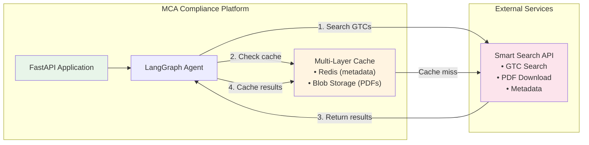

# Smart Search API Integration

**Version**: 1.0
**Last Updated**: 2025-10-02
**Status**: Active
**Owner**: Compliance Platform Team

## Overview

The Smart Search API is an external service that provides search and retrieval capabilities for General Terms & Conditions (GTC) documents. This document describes how the MCA Compliance Platform integrates with Smart Search to enable GTC validation during article compliance checking.

### Purpose

- **Search GTCs**: Find relevant GTC documents based on article content and keywords
- **Download PDFs**: Retrieve official GTC PDF documents for validation
- **Metadata Retrieval**: Get GTC metadata (title, version, effective date, etc.)
- **Caching Strategy**: Optimize performance and reduce API costs through multi-layer caching

### Integration Context

Smart Search is used during the compliance checking workflow to:
1. Extract keywords/entities from marketing articles
2. Search for relevant GTC documents
3. Download and cache GTC PDFs
4. Validate article content against official GTC requirements
5. Provide users with references to specific GTC sections

## Architecture Integration

### System Context



### Integration Points by Scale

| Architecture Scale | Integration Approach | Caching Strategy | Estimated Cost |
|-------------------|---------------------|------------------|----------------|
| **Small Scale** | Direct API calls | Blob Storage only (30 days) | €20-50/month |
| **Medium Scale** | Redis + Blob caching | Redis (1 hour) + Blob (30 days) | €50-300/month |
| **Large Scale** | Multi-region, geo-replicated | Redis geo-replication + GZRS Blob | €600-1,000/month |

## API Specification

### Base URL

```
Production: https://api.smartsearch.example.com/v1
Staging: https://api-staging.smartsearch.example.com/v1
```

### Authentication

**Method**: Bearer Token (API Key)

```http
Authorization: Bearer {SMART_SEARCH_API_KEY}
```

**Key Management**:
- Stored in Azure Key Vault
- Rotated every 90 days (automated)
- Scoped to specific operations (search, download)

### API Endpoints

#### 1. Search GTCs

**Endpoint**: `POST /search`

**Description**: Search for GTC documents based on query parameters.

**Request**:
```http
POST /v1/search
Authorization: Bearer {api_key}
Content-Type: application/json

{
  "query": "insurance claim processing requirements",
  "filters": {
    "document_type": "GTC",
    "effective_after": "2024-01-01",
    "language": "en",
    "region": ["EU", "DE"]
  },
  "limit": 5,
  "offset": 0
}
```

**Response** (200 OK):
```json
{
  "results": [
    {
      "gtc_id": "GTC-2024-001",
      "title": "General Terms and Conditions for Insurance Claims",
      "version": "2.1",
      "effective_date": "2024-03-15",
      "language": "en",
      "region": "EU",
      "relevance_score": 0.95,
      "summary": "Comprehensive terms for insurance claim processing...",
      "document_url": "/v1/documents/GTC-2024-001/download",
      "metadata": {
        "author": "Legal Department",
        "category": "Claims Processing",
        "tags": ["insurance", "claims", "requirements"]
      }
    },
    {
      "gtc_id": "GTC-2024-002",
      "title": "Claims Handling Guidelines",
      "version": "1.0",
      "effective_date": "2024-01-10",
      "language": "en",
      "region": "DE",
      "relevance_score": 0.87,
      "summary": "Guidelines for handling insurance claims...",
      "document_url": "/v1/documents/GTC-2024-002/download",
      "metadata": {
        "author": "Compliance Team",
        "category": "Guidelines",
        "tags": ["claims", "handling", "procedures"]
      }
    }
  ],
  "total_results": 12,
  "page": 1,
  "per_page": 5,
  "query_id": "qry_abc123xyz"
}
```

**Error Responses**:
```json
// 400 Bad Request
{
  "error": "invalid_request",
  "message": "Query parameter is required",
  "details": {
    "field": "query",
    "constraint": "min_length: 3"
  }
}

// 401 Unauthorized
{
  "error": "unauthorized",
  "message": "Invalid or expired API key"
}

// 429 Too Many Requests
{
  "error": "rate_limit_exceeded",
  "message": "Rate limit exceeded. Retry after 60 seconds.",
  "retry_after": 60
}

// 503 Service Unavailable
{
  "error": "service_unavailable",
  "message": "Smart Search API is temporarily unavailable",
  "estimated_recovery": "2025-10-02T15:30:00Z"
}
```

#### 2. Download GTC PDF

**Endpoint**: `GET /documents/{gtc_id}/download`

**Description**: Download the PDF version of a specific GTC document.

**Request**:
```http
GET /v1/documents/GTC-2024-001/download
Authorization: Bearer {api_key}
Accept: application/pdf
```

**Response** (200 OK):
```
Content-Type: application/pdf
Content-Disposition: attachment; filename="GTC-2024-001_v2.1.pdf"
Content-Length: 1245678
X-GTC-ID: GTC-2024-001
X-GTC-Version: 2.1
X-GTC-Checksum: sha256:abcdef1234567890...

<binary PDF content>
```

**Error Responses**:
```json
// 404 Not Found
{
  "error": "document_not_found",
  "message": "GTC document not found",
  "gtc_id": "GTC-2024-999"
}

// 410 Gone
{
  "error": "document_archived",
  "message": "This GTC document has been archived",
  "gtc_id": "GTC-2020-001",
  "archived_date": "2024-01-01",
  "replacement_gtc_id": "GTC-2024-001"
}
```

#### 3. Get GTC Metadata

**Endpoint**: `GET /documents/{gtc_id}`

**Description**: Retrieve metadata for a specific GTC document without downloading the PDF.

**Request**:
```http
GET /v1/documents/GTC-2024-001
Authorization: Bearer {api_key}
```

**Response** (200 OK):
```json
{
  "gtc_id": "GTC-2024-001",
  "title": "General Terms and Conditions for Insurance Claims",
  "version": "2.1",
  "effective_date": "2024-03-15",
  "expiration_date": null,
  "language": "en",
  "region": "EU",
  "status": "active",
  "document_url": "/v1/documents/GTC-2024-001/download",
  "file_size_bytes": 1245678,
  "page_count": 42,
  "checksum": "sha256:abcdef1234567890...",
  "metadata": {
    "author": "Legal Department",
    "category": "Claims Processing",
    "tags": ["insurance", "claims", "requirements"],
    "last_updated": "2024-03-15T10:00:00Z",
    "reviewed_by": "Compliance Team",
    "approval_date": "2024-03-01"
  },
  "versions": [
    {
      "version": "2.0",
      "effective_date": "2023-06-01",
      "document_url": "/v1/documents/GTC-2024-001/versions/2.0/download"
    },
    {
      "version": "1.0",
      "effective_date": "2022-01-15",
      "document_url": "/v1/documents/GTC-2024-001/versions/1.0/download"
    }
  ]
}
```

#### 4. Health Check

**Endpoint**: `GET /health`

**Description**: Check the health status of the Smart Search API.

**Request**:
```http
GET /v1/health
```

**Response** (200 OK):
```json
{
  "status": "healthy",
  "version": "1.2.3",
  "timestamp": "2025-10-02T14:30:00Z",
  "components": {
    "search_engine": "healthy",
    "document_storage": "healthy",
    "database": "healthy"
  },
  "response_time_ms": 45
}
```

## Python Client Implementation

### Basic Client

```python
import httpx
import hashlib
from typing import List, Optional
from datetime import datetime, timedelta

class SmartSearchClient:
    """Basic Smart Search API client for Small Scale architecture"""

    def __init__(self, api_key: str, base_url: str):
        self.api_key = api_key
        self.base_url = base_url
        self.client = httpx.AsyncClient(
            base_url=base_url,
            headers={"Authorization": f"Bearer {api_key}"},
            timeout=30.0
        )

    async def search(
        self,
        query: str,
        filters: Optional[dict] = None,
        limit: int = 5
    ) -> List[dict]:
        """Search for GTC documents"""
        try:
            response = await self.client.post(
                "/search",
                json={
                    "query": query,
                    "filters": filters or {},
                    "limit": limit
                }
            )
            response.raise_for_status()
            data = response.json()
            return data["results"]

        except httpx.HTTPStatusError as e:
            if e.response.status_code == 429:
                # Rate limit exceeded
                retry_after = int(e.response.headers.get("Retry-After", 60))
                raise RateLimitError(f"Rate limit exceeded. Retry after {retry_after}s")
            elif e.response.status_code == 503:
                raise ServiceUnavailableError("Smart Search API unavailable")
            else:
                raise

    async def download_pdf(self, gtc_id: str) -> bytes:
        """Download GTC PDF"""
        try:
            response = await self.client.get(
                f"/documents/{gtc_id}/download",
                headers={"Accept": "application/pdf"}
            )
            response.raise_for_status()
            return response.content

        except httpx.HTTPStatusError as e:
            if e.response.status_code == 404:
                raise DocumentNotFoundError(f"GTC {gtc_id} not found")
            elif e.response.status_code == 410:
                # Document archived
                data = e.response.json()
                replacement_id = data.get("replacement_gtc_id")
                raise DocumentArchivedError(
                    f"GTC {gtc_id} archived. Replacement: {replacement_id}"
                )
            else:
                raise

    async def get_metadata(self, gtc_id: str) -> dict:
        """Get GTC metadata without downloading PDF"""
        response = await self.client.get(f"/documents/{gtc_id}")
        response.raise_for_status()
        return response.json()

    async def health_check(self) -> dict:
        """Check API health status"""
        response = await self.client.get("/health")
        response.raise_for_status()
        return response.json()

    async def close(self):
        """Close HTTP client"""
        await self.client.aclose()


# Custom exceptions
class SmartSearchError(Exception):
    """Base exception for Smart Search errors"""
    pass

class RateLimitError(SmartSearchError):
    """Rate limit exceeded"""
    pass

class ServiceUnavailableError(SmartSearchError):
    """Service temporarily unavailable"""
    pass

class DocumentNotFoundError(SmartSearchError):
    """Document not found"""
    pass

class DocumentArchivedError(SmartSearchError):
    """Document has been archived"""
    pass
```

### Client with Caching (Medium Scale)

```python
import httpx
import hashlib
import json
from typing import List, Optional
from datetime import datetime, timedelta
from azure.storage.blob import BlobServiceClient
from redis import Redis

class CachedSmartSearchClient:
    """Smart Search client with Redis + Blob caching for Medium Scale"""

    def __init__(
        self,
        api_key: str,
        base_url: str,
        redis_client: Redis,
        blob_client: BlobServiceClient
    ):
        self.api_key = api_key
        self.base_url = base_url
        self.redis = redis_client
        self.blob_service = blob_client
        self.container_name = "gtc-cache"

        self.http_client = httpx.AsyncClient(
            base_url=base_url,
            headers={"Authorization": f"Bearer {api_key}"},
            timeout=30.0
        )

    async def search_with_cache(
        self,
        query: str,
        filters: Optional[dict] = None,
        limit: int = 5
    ) -> List[dict]:
        """Search GTCs with Redis caching"""

        # Generate cache key
        search_hash = hashlib.sha256(
            f"{query}:{json.dumps(filters or {})}:{limit}".encode()
        ).hexdigest()
        cache_key = f"gtc:metadata:{search_hash}"

        # Check Redis cache
        cached_result = self.redis.get(cache_key)
        if cached_result:
            return json.loads(cached_result)

        # Cache miss - call API
        response = await self.http_client.post(
            "/search",
            json={
                "query": query,
                "filters": filters or {},
                "limit": limit
            }
        )
        response.raise_for_status()
        results = response.json()["results"]

        # Cache in Redis (1 hour TTL)
        self.redis.setex(
            cache_key,
            3600,
            json.dumps(results)
        )

        return results

    async def download_pdf_with_cache(self, gtc_id: str) -> bytes:
        """Download GTC PDF with Blob Storage caching"""

        # Check Blob Storage cache
        blob_client = self.blob_service.get_blob_client(
            container=self.container_name,
            blob=f"{gtc_id}.pdf"
        )

        try:
            # Try to get from cache
            blob_data = blob_client.download_blob()
            metadata = blob_client.get_blob_properties().metadata

            # Check if expired
            expires_at = datetime.fromisoformat(metadata.get("expires_at", ""))
            if datetime.utcnow() < expires_at:
                return blob_data.readall()

        except Exception:
            pass  # Cache miss, proceed to download

        # Download from Smart Search API
        response = await self.http_client.get(
            f"/documents/{gtc_id}/download",
            headers={"Accept": "application/pdf"}
        )
        response.raise_for_status()
        pdf_content = response.content

        # Cache in Blob Storage (30 days)
        blob_client.upload_blob(
            pdf_content,
            metadata={
                "cached_at": datetime.utcnow().isoformat(),
                "expires_at": (
                    datetime.utcnow() + timedelta(days=30)
                ).isoformat(),
                "gtc_id": gtc_id,
                "checksum": hashlib.sha256(pdf_content).hexdigest()
            },
            overwrite=True
        )

        return pdf_content

    async def close(self):
        """Close HTTP client"""
        await self.http_client.aclose()
```

## LangGraph Agent Integration

### GTC Retrieval Workflow

```python
from langgraph.graph import Graph, StateGraph
from typing import TypedDict, List

class ComplianceState(TypedDict):
    article_content: str
    keywords: List[str]
    gtc_documents: List[dict]
    compliance_results: List[dict]

# Define LangGraph workflow
workflow = StateGraph(ComplianceState)

async def extract_keywords(state: ComplianceState) -> ComplianceState:
    """Extract keywords from article for GTC search"""
    # Use NLP/LLM to extract relevant keywords
    keywords = await nlp_extract_keywords(state["article_content"])
    state["keywords"] = keywords
    return state

async def search_gtcs(state: ComplianceState) -> ComplianceState:
    """Search for relevant GTCs using Smart Search"""
    smart_search = get_smart_search_client()

    # Construct search query from keywords
    query = " ".join(state["keywords"])

    # Search GTCs
    results = await smart_search.search_with_cache(
        query=query,
        filters={
            "document_type": "GTC",
            "language": "en",
            "status": "active"
        },
        limit=5
    )

    state["gtc_documents"] = results
    return state

async def download_gtcs(state: ComplianceState) -> ComplianceState:
    """Download GTC PDFs for validation"""
    smart_search = get_smart_search_client()

    for gtc in state["gtc_documents"]:
        gtc_id = gtc["gtc_id"]

        # Download PDF
        pdf_content = await smart_search.download_pdf_with_cache(gtc_id)

        # Extract text from PDF
        gtc_text = await extract_text_from_pdf(pdf_content)

        # Add to GTC document
        gtc["content"] = gtc_text

    return state

async def validate_against_gtcs(state: ComplianceState) -> ComplianceState:
    """Validate article content against GTCs"""
    validation_results = []

    for gtc in state["gtc_documents"]:
        # Use LLM to validate article against GTC
        result = await llm_validate_article(
            article=state["article_content"],
            gtc_content=gtc["content"],
            gtc_metadata=gtc
        )

        validation_results.append({
            "gtc_id": gtc["gtc_id"],
            "gtc_title": gtc["title"],
            "status": result["status"],  # pass, fail, warning
            "violations": result["violations"],
            "suggestions": result["suggestions"]
        })

    state["compliance_results"] = validation_results
    return state

# Build workflow graph
workflow.add_node("extract_keywords", extract_keywords)
workflow.add_node("search_gtcs", search_gtcs)
workflow.add_node("download_gtcs", download_gtcs)
workflow.add_node("validate_gtcs", validate_against_gtcs)

workflow.add_edge("extract_keywords", "search_gtcs")
workflow.add_edge("search_gtcs", "download_gtcs")
workflow.add_edge("download_gtcs", "validate_gtcs")

workflow.set_entry_point("extract_keywords")

# Compile workflow
compliance_agent = workflow.compile()
```

## Error Handling and Resilience

### Retry Strategy

```python
import asyncio
import random
from typing import Callable, Any

async def retry_with_exponential_backoff(
    func: Callable,
    max_retries: int = 3,
    base_delay: float = 1.0,
    max_delay: float = 30.0,
    jitter: bool = True
) -> Any:
    """Retry function with exponential backoff"""

    for attempt in range(max_retries):
        try:
            return await func()

        except (httpx.HTTPError, httpx.TimeoutException) as e:
            if attempt == max_retries - 1:
                # Last attempt, raise exception
                raise

            # Calculate delay
            delay = min(base_delay * (2 ** attempt), max_delay)

            # Add jitter to prevent thundering herd
            if jitter:
                delay += random.uniform(0, delay * 0.1)

            logger.warning(
                f"Attempt {attempt + 1} failed, retrying in {delay:.2f}s",
                extra={"error": str(e)}
            )

            await asyncio.sleep(delay)

# Usage
async def search_gtcs_with_retry(query: str):
    return await retry_with_exponential_backoff(
        lambda: smart_search_client.search(query),
        max_retries=3,
        base_delay=1.0
    )
```

### Circuit Breaker Pattern

```python
from enum import Enum
from datetime import datetime, timedelta

class CircuitState(Enum):
    CLOSED = "closed"
    OPEN = "open"
    HALF_OPEN = "half_open"

class CircuitBreaker:
    """Circuit breaker for Smart Search API calls"""

    def __init__(
        self,
        failure_threshold: int = 5,
        recovery_timeout: int = 60,
        half_open_timeout: int = 30
    ):
        self.failure_threshold = failure_threshold
        self.recovery_timeout = recovery_timeout
        self.half_open_timeout = half_open_timeout

        self.state = CircuitState.CLOSED
        self.failure_count = 0
        self.last_failure_time = None
        self.last_state_change = datetime.utcnow()

    def __enter__(self):
        if self.state == CircuitState.OPEN:
            # Check if recovery timeout has passed
            if (
                datetime.utcnow() - self.last_state_change
                > timedelta(seconds=self.recovery_timeout)
            ):
                # Transition to HALF_OPEN
                self.state = CircuitState.HALF_OPEN
                self.last_state_change = datetime.utcnow()
            else:
                raise CircuitBreakerError("Circuit breaker is OPEN")

        return self

    def __exit__(self, exc_type, exc_val, exc_tb):
        if exc_type is None:
            # Success
            if self.state == CircuitState.HALF_OPEN:
                # Transition to CLOSED
                self.state = CircuitState.CLOSED
                self.failure_count = 0
                self.last_state_change = datetime.utcnow()
            return False

        # Failure
        self.failure_count += 1
        self.last_failure_time = datetime.utcnow()

        if self.failure_count >= self.failure_threshold:
            # Transition to OPEN
            self.state = CircuitState.OPEN
            self.last_state_change = datetime.utcnow()

        return False  # Re-raise exception

class CircuitBreakerError(Exception):
    """Circuit breaker is open"""
    pass
```

### Graceful Degradation

```python
async def search_gtcs_with_fallback(
    query: str,
    smart_search_client: SmartSearchClient
) -> List[dict]:
    """Search GTCs with graceful degradation"""

    try:
        # Try primary Smart Search API
        results = await smart_search_client.search(query)
        return results

    except ServiceUnavailableError:
        logger.warning("Smart Search API unavailable, using fallback")

        # Fallback: Return empty results with warning
        # Compliance check continues without GTC validation
        return []

    except RateLimitError:
        logger.warning("Smart Search rate limit exceeded")

        # Fallback: Use cached results from last 24 hours (even if expired)
        cached_results = await get_stale_cache_results(query)
        if cached_results:
            logger.info("Using stale cache results as fallback")
            return cached_results
        else:
            return []

    except Exception as e:
        logger.error(f"Unexpected Smart Search error: {e}")
        # Continue without GTC validation
        return []
```

## Performance Optimization

### Batch Operations

```python
async def batch_download_gtcs(
    gtc_ids: List[str],
    smart_search_client: CachedSmartSearchClient,
    concurrency: int = 5
) -> dict[str, bytes]:
    """Download multiple GTCs concurrently"""

    semaphore = asyncio.Semaphore(concurrency)

    async def download_with_semaphore(gtc_id: str) -> tuple[str, bytes]:
        async with semaphore:
            try:
                pdf_content = await smart_search_client.download_pdf_with_cache(gtc_id)
                return (gtc_id, pdf_content)
            except Exception as e:
                logger.error(f"Failed to download {gtc_id}: {e}")
                return (gtc_id, None)

    # Download all GTCs concurrently
    results = await asyncio.gather(
        *[download_with_semaphore(gtc_id) for gtc_id in gtc_ids]
    )

    return {gtc_id: content for gtc_id, content in results if content is not None}
```

### Connection Pooling

```python
import httpx

# Configure connection pool for Smart Search API
smart_search_http_client = httpx.AsyncClient(
    base_url="https://api.smartsearch.example.com/v1",
    headers={"Authorization": f"Bearer {api_key}"},
    timeout=30.0,
    limits=httpx.Limits(
        max_connections=100,
        max_keepalive_connections=20,
        keepalive_expiry=30.0
    )
)
```

## Monitoring and Observability

### Metrics to Track

```python
from prometheus_client import Counter, Histogram, Gauge

# Smart Search API metrics
smart_search_requests_total = Counter(
    "smart_search_requests_total",
    "Total Smart Search API requests",
    ["operation", "status"]
)

smart_search_latency_seconds = Histogram(
    "smart_search_latency_seconds",
    "Smart Search API latency",
    ["operation"]
)

smart_search_cache_hit_rate = Gauge(
    "smart_search_cache_hit_rate",
    "Cache hit rate for Smart Search",
    ["cache_layer"]
)

gtc_cache_size_bytes = Gauge(
    "gtc_cache_size_bytes",
    "Total size of GTC cache"
)

# Usage
async def search_with_metrics(query: str):
    with smart_search_latency_seconds.labels(operation="search").time():
        try:
            results = await smart_search_client.search(query)
            smart_search_requests_total.labels(
                operation="search",
                status="success"
            ).inc()
            return results
        except Exception as e:
            smart_search_requests_total.labels(
                operation="search",
                status="error"
            ).inc()
            raise
```

### Logging

```python
import logging
import structlog

# Configure structured logging
logger = structlog.get_logger()

# Example: Log Smart Search API call
logger.info(
    "smart_search_api_call",
    operation="search",
    query=query,
    filters=filters,
    response_time_ms=response_time,
    results_count=len(results),
    cache_hit=cache_hit
)

# Example: Log error
logger.error(
    "smart_search_api_error",
    operation="download",
    gtc_id=gtc_id,
    error=str(e),
    retry_attempt=retry_attempt
)
```

## Security Considerations

### API Key Management

1. **Storage**: Store API keys in Azure Key Vault
2. **Rotation**: Rotate keys every 90 days (automated)
3. **Scope**: Use separate keys for different environments (dev, staging, prod)
4. **Access Control**: Restrict Key Vault access to application managed identity

### Data Privacy

1. **Encryption in Transit**: All API calls use HTTPS/TLS 1.2+
2. **Encryption at Rest**: Cached GTC PDFs encrypted in Blob Storage
3. **Data Retention**: GTC PDFs cached for 30 days maximum
4. **Audit Logging**: All Smart Search API calls logged for compliance

### Rate Limiting

1. **Respect API Limits**: Honor Smart Search API rate limits
2. **Implement Client-Side Rate Limiting**: Prevent exceeding limits
3. **Handle 429 Responses**: Implement exponential backoff

## Testing

### Unit Tests

```python
import pytest
from unittest.mock import Mock, AsyncMock

@pytest.mark.asyncio
async def test_search_gtcs():
    """Test GTC search functionality"""
    mock_client = Mock()
    mock_client.post = AsyncMock(return_value=Mock(
        status_code=200,
        json=lambda: {
            "results": [
                {"gtc_id": "GTC-001", "title": "Test GTC"}
            ]
        }
    ))

    client = SmartSearchClient(api_key="test", base_url="http://test")
    client.client = mock_client

    results = await client.search("test query")

    assert len(results) == 1
    assert results[0]["gtc_id"] == "GTC-001"

@pytest.mark.asyncio
async def test_download_pdf_with_cache():
    """Test PDF download with caching"""
    # Mock Blob Storage
    mock_blob = Mock()
    mock_blob.exists.return_value = True
    mock_blob.download_blob.return_value = Mock(readall=lambda: b"cached pdf")

    # Test cache hit
    client = CachedSmartSearchClient(
        api_key="test",
        base_url="http://test",
        redis_client=Mock(),
        blob_client=Mock()
    )

    pdf_content = await client.download_pdf_with_cache("GTC-001")
    assert pdf_content == b"cached pdf"
```

### Integration Tests

```python
@pytest.mark.integration
@pytest.mark.asyncio
async def test_smart_search_integration():
    """Test actual Smart Search API integration"""
    # Use test API key from environment
    api_key = os.getenv("SMART_SEARCH_TEST_API_KEY")
    client = SmartSearchClient(
        api_key=api_key,
        base_url="https://api-staging.smartsearch.example.com/v1"
    )

    # Test search
    results = await client.search("insurance claims")
    assert len(results) > 0

    # Test download
    gtc_id = results[0]["gtc_id"]
    pdf_content = await client.download_pdf(gtc_id)
    assert len(pdf_content) > 0
    assert pdf_content[:4] == b"%PDF"  # PDF magic number

    await client.close()
```

## Troubleshooting

### Common Issues

#### 1. API Rate Limit Exceeded

**Symptom**: 429 Too Many Requests errors

**Solution**:
- Increase cache TTL to reduce API calls
- Implement distributed rate limiting
- Contact Smart Search support to increase rate limits

#### 2. Slow PDF Downloads

**Symptom**: PDF downloads taking >10 seconds

**Solution**:
- Check network connectivity to Smart Search API
- Verify Blob Storage caching is working
- Consider pre-caching frequently accessed GTCs

#### 3. Stale Cache Data

**Symptom**: Using outdated GTC documents

**Solution**:
- Reduce cache TTL from 30 days to 7 days
- Implement cache invalidation webhook from Smart Search
- Periodically refresh cache for active GTCs

#### 4. Circuit Breaker Stuck Open

**Symptom**: Smart Search API calls blocked by circuit breaker

**Solution**:
- Verify Smart Search API is actually healthy
- Check circuit breaker recovery timeout (default: 60s)
- Manually reset circuit breaker if needed
- Review failure threshold settings

### Debug Logging

```python
# Enable debug logging for Smart Search client
import logging

logging.getLogger("smart_search_client").setLevel(logging.DEBUG)

# Log all HTTP requests/responses
httpx_logger = logging.getLogger("httpx")
httpx_logger.setLevel(logging.DEBUG)
```

## Changelog

### Version 1.0 (2025-10-02)
- Initial documentation
- Smart Search API v1 integration
- Multi-layer caching strategy
- Circuit breaker pattern
- LangGraph agent integration

---

**Related Documents**:
- [Architecture - Small Scale](../architecture/ARCHITECTURE_SMALL_SCALE.md)
- [Architecture - Medium Scale](../architecture/ARCHITECTURE_MEDIUM_SCALE.md)
- [Architecture - Large Scale](../architecture/ARCHITECTURE_LARGE_SCALE.md)

**Support Contact**: compliance-platform-team@example.com
