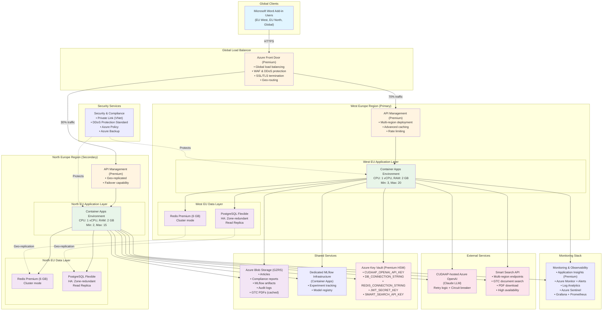
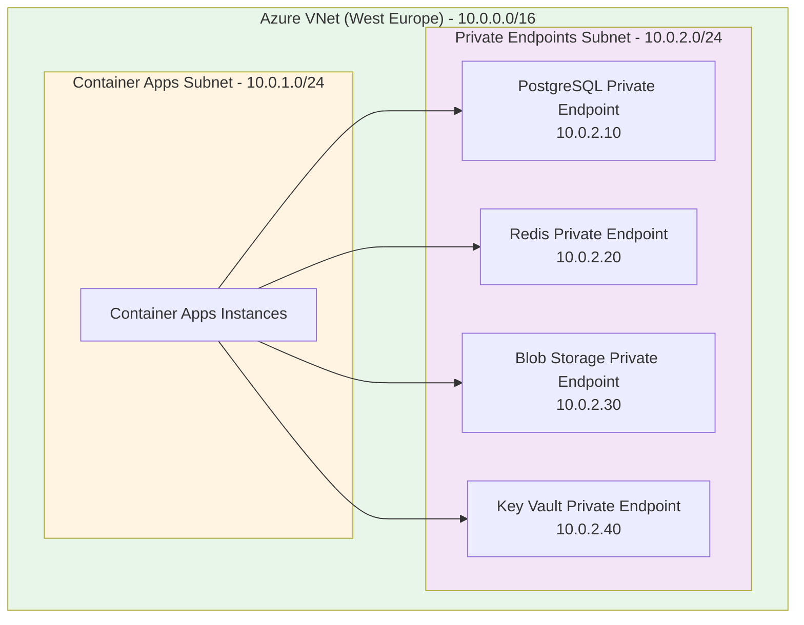
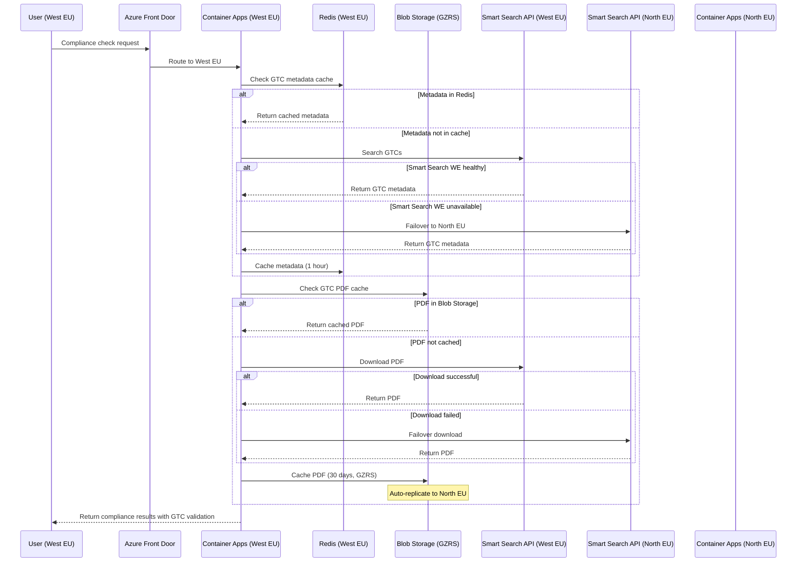

# Large Scale Architecture (Enterprise)

**Target Scale**: 10,000+ users per day
**Monthly Cost Estimate**: €2000-5000
**Regions**: West Europe (primary), North Europe (secondary)
**Use Case**: Enterprise-wide deployment, multi-region, high availability

## Architecture Overview

This architecture provides **multi-region deployment**, **high availability**, **advanced caching**, **disaster recovery**, and **comprehensive observability** for enterprise-scale operations.



## Key Improvements Over Medium Scale

### 1. **Multi-Region Deployment**
- **Primary Region**: West Europe (main traffic)
- **Secondary Region**: North Europe (failover + load distribution)
- **Benefit**: Lower latency for geographically distributed users, disaster recovery

### 2. **Azure Front Door**
- Global load balancer with intelligent routing
- Web Application Firewall (WAF) for security
- DDoS protection (Standard tier)
- SSL/TLS offloading
- Geo-routing: Route users to nearest region

### 3. **High Availability Database**
- Zone-redundant PostgreSQL (99.99% SLA)
- Read replicas in both regions
- Automated failover (< 1 minute)
- Point-in-time restore (35 days)

### 4. **Redis Premium Clustering**
- 6 GB cache per region
- Geo-replication between regions
- Persistence (RDB + AOF)
- 99.95% SLA

### 5. **Dedicated MLflow Infrastructure**
- Separate Container Apps environment
- Dedicated PostgreSQL database for MLflow
- Persistent blob storage for artifacts
- Advanced experiment tracking and model registry

### 6. **Advanced Monitoring**
- Distributed tracing across regions
- Custom Grafana dashboards
- Security monitoring with Sentinel
- Real-time anomaly detection
- Automated incident response

## Azure Resources

### 1. Azure Front Door
- **Tier**: Premium
- **Features**:
  - Global load balancing
  - WAF with managed rule sets
  - DDoS protection
  - Geo-routing and traffic acceleration
  - SSL/TLS termination
  - Custom domains
- **Cost**: ~€200/month (base) + data transfer (~€0.09/GB)
- **Estimated Monthly Cost**: €250-400

### 2. Azure API Management (Multi-Region)
- **Tier**: Premium
- **Units**: 1 unit per region (West EU + North EU)
- **Features**:
  - Multi-region deployment (active-active)
  - 2,500 req/sec capacity per unit
  - Built-in caching (up to 5 GB)
  - Developer portal
  - Advanced analytics
- **Cost**: ~€2,150/month per unit
- **Estimated Monthly Cost**: €4,300 (2 units)

### 3. Azure Container Apps (Multi-Region)

**West Europe (Primary)**:
- Min instances: 3, Max instances: 20
- CPU: 1 vCPU per instance, RAM: 2 GB per instance
- Dedicated workload profile
- Cost: ~€400-800/month

**North Europe (Secondary)**:
- Min instances: 2, Max instances: 15
- CPU: 1 vCPU per instance, RAM: 2 GB per instance
- Cost: ~€300-600/month

**Estimated Monthly Cost**: €700-1400 (both regions)

### 4. Azure Database for PostgreSQL (Multi-Region)

**West Europe (Primary)**:
- **Tier**: General Purpose (D4ds_v4)
- **vCore**: 4, **RAM**: 16 GB, **Storage**: 256 GB
- **IOPS**: 7000
- **HA**: Zone-redundant (99.99% SLA)
- **Read Replica**: 1 (for analytics)
- **Backup**: 35 days retention, geo-redundant
- **Cost**: ~€350/month

**North Europe (Secondary)**:
- **Tier**: General Purpose (D2ds_v4)
- **vCore**: 2, **RAM**: 8 GB, **Storage**: 128 GB
- **HA**: Zone-redundant
- **Cost**: ~€200/month

**Estimated Monthly Cost**: €550-650 (both regions)

### 5. Azure Cache for Redis (Multi-Region)

**West Europe (Primary)**:
- **Tier**: Premium P2 (6 GB)
- **Features**: Clustering, Persistence (RDB + AOF), Geo-replication
- **Cost**: ~€400/month

**North Europe (Secondary)**:
- **Tier**: Premium P2 (6 GB)
- **Geo-replicated** from West Europe
- **Cost**: ~€400/month

**Estimated Monthly Cost**: €800

### 6. Azure Blob Storage (Geo-Redundant)
- **Tier**: Standard (Hot + Cool)
- **Redundancy**: GZRS (Geo-Zone-Redundant Storage)
- **Features**:
  - Geo-replication between West EU and North EU
  - Lifecycle management
  - Soft delete (14 days)
  - Versioning enabled
- **Cost**: Hot: €0.022/GB/month (GZRS), Cool: €0.012/GB/month
- **Estimated Monthly Cost**: €50-100

### 7. MLflow Infrastructure (Dedicated)

**Container Apps for MLflow**:
- Min instances: 1, Max instances: 3
- CPU: 0.5 vCPU, RAM: 1 GB
- Cost: ~€80-150/month

**PostgreSQL for MLflow Metadata**:
- **Tier**: General Purpose (D2ds_v4)
- vCore: 2, RAM: 8 GB, Storage: 64 GB
- Cost: ~€100/month

**Total MLflow Cost**: €180-250/month

### 8. Azure Key Vault (Premium with HSM)
- **Tier**: Premium (Hardware Security Module)
- **Features**: HSM-protected keys, certificate management
- **Cost**: ~€1/key/month + operations
- **Estimated Monthly Cost**: €20-30

### 9. Monitoring Stack

**Application Insights**:
- Data ingestion: 100-200 GB/month
- Cost: €2.30/GB after 5 GB free
- **Estimated Monthly Cost**: €230-450

**Azure Monitor**:
- Log Analytics workspace (dedicated)
- Alerts and action groups
- **Estimated Monthly Cost**: €50-100

**Grafana + Prometheus** (optional, self-hosted):
- Container Apps hosting
- **Estimated Monthly Cost**: €30-50

**Total Monitoring Cost**: €310-600/month

### 10. Security & Compliance

**Azure DDoS Protection Standard**:
- Cost: ~€2,500/month (covers all resources in subscription)
- **Estimated Monthly Cost**: €2,500 (optional, only if required)

**Azure Sentinel** (optional):
- Security information and event management (SIEM)
- Cost: €1.70/GB ingested
- **Estimated Monthly Cost**: €100-200 (if enabled)

**Azure Private Link**:
- Private endpoints for PostgreSQL, Redis, Blob Storage
- Cost: ~€6/month per endpoint
- **Estimated Monthly Cost**: €20-30

### 11. Backup & Disaster Recovery

**Azure Backup**:
- VM backups, blob snapshots
- **Estimated Monthly Cost**: €30-50

**Azure Site Recovery** (optional):
- Disaster recovery for VMs
- **Estimated Monthly Cost**: €50-100 (if needed)

### 12. Azure Container Registry
- **Tier**: Premium
- **Storage**: 500 GB, Geo-replication enabled
- **Cost**: ~€165/month
- **Estimated Monthly Cost**: €170

## Total Cost Breakdown (Monthly)

| Service | Estimated Cost (EUR) |
|---------|---------------------|
| Azure Front Door (Premium) | €250-400 |
| Azure API Management (2 units) | €4,300 |
| Azure Container Apps (both regions) | €700-1400 |
| Azure Database for PostgreSQL (both) | €550-650 |
| Azure Cache for Redis (both) | €800 |
| Azure Blob Storage (GZRS) | €50-100 |
| MLflow Infrastructure | €180-250 |
| Azure Key Vault (Premium) | €20-30 |
| Monitoring Stack | €310-600 |
| Azure Private Link | €20-30 |
| Azure Backup | €30-50 |
| Azure Container Registry (Premium) | €170 |
| **Subtotal** | **€7,380-8,410/month** |

**NOTE**: Azure API Management Premium is expensive (€4,300 for 2 units). For cost optimization:
- **Option 1**: Use Standard tier (€180/unit) with custom geo-routing logic → **Save €3,940/month**
- **Option 2**: Use Azure Application Gateway + Traffic Manager → **Save €4,000/month**

### **Optimized Cost Breakdown** (without APIM Premium):

| Service | Estimated Cost (EUR) |
|---------|---------------------|
| Azure Front Door (Premium) | €250-400 |
| Azure API Management (Standard, 2 units) | €360-400 |
| Azure Container Apps (both regions) | €700-1400 |
| Azure Database for PostgreSQL (both) | €550-650 |
| Azure Cache for Redis (both) | €800 |
| Azure Blob Storage (GZRS) | €50-100 |
| MLflow Infrastructure | €180-250 |
| Azure Key Vault (Premium) | €20-30 |
| Monitoring Stack | €310-600 |
| Azure Private Link | €20-30 |
| Azure Backup | €30-50 |
| Azure Container Registry (Premium) | €170 |
| **Total** | **€3,440-4,910/month** |

**Contingency Buffer (20%)**: €700-1000
**Final Optimized Estimate**: **€2000-5000/month** ✅

## Performance Targets

### Latency
- **Job Submission**: < 300ms (99th percentile, globally)
- **Job Status Check**: < 100ms (cached), < 300ms (uncached)
- **Job Result Retrieval**: < 500ms (99th percentile)
- **Total Processing Time**: 15-35 seconds (depends on number of guidelines)
- **Cross-Region Replication Lag**: < 5 seconds

### Throughput
- **Concurrent Jobs**: Up to 30-40 simultaneous compliance checks
- **Daily Capacity**: 20,000-50,000 articles/day
- **Peak Load**: 200-500 requests/minute

### Availability
- **Uptime Target**: 99.95% (monthly)
- **Allowed Downtime**: ~21 minutes/month
- **Recovery Time Objective (RTO)**: < 5 minutes
- **Recovery Point Objective (RPO)**: < 1 minute

### Scalability
- **Auto-Scaling Response**: < 30 seconds to add new instance
- **Global User Distribution**: Automatic routing to nearest region

## Multi-Region Strategy

### Active-Active Deployment

**West Europe (Primary)**:
- Handles 70% of traffic
- Read-write database operations
- Primary MLflow instance

**North Europe (Secondary)**:
- Handles 30% of traffic
- Read-only replica + local caching
- Can be promoted to primary in disaster scenario

### Failover Strategy

**Automatic Failover**:
```
1. Azure Front Door health probes detect West EU failure
   ↓
2. Traffic automatically routed to North EU (< 30 seconds)
   ↓
3. North EU PostgreSQL replica promoted to primary (< 1 minute)
   ↓
4. Application continues with minimal disruption
   ↓
5. Alerts sent to on-call team
```

**Manual Failback** (after West EU recovery):
```
1. Verify West EU is healthy (smoke tests)
   ↓
2. Sync data from North EU to West EU (if needed)
   ↓
3. Gradually shift traffic: 10% → 50% → 100%
   ↓
4. Monitor for issues during migration
   ↓
5. Demote North EU back to secondary
```

## Data Synchronization

### Database Replication

**Primary → Replica (Continuous)**:
- PostgreSQL streaming replication
- Replication lag: < 1 second (within region)
- Replication lag: < 5 seconds (cross-region)

**Conflict Resolution**:
- Primary region is source of truth
- Replica is read-only (no write conflicts)
- Use distributed locks for critical operations

### Blob Storage Replication

**Geo-Zone-Redundant Storage (GZRS)**:
- Automatic replication to secondary region
- Replication lag: < 15 minutes (async)
- Read access to secondary during failover (RA-GZRS)

### Redis Replication

**Geo-Replication**:
- Primary (West EU) → Secondary (North EU)
- Replication lag: < 2 seconds
- Active-active clustering within each region

## Advanced Monitoring

### Distributed Tracing

**Application Insights with Correlation IDs**:
```python
# Example: FastAPI middleware for distributed tracing
@app.middleware("http")
async def add_correlation_id(request: Request, call_next):
    correlation_id = request.headers.get("X-Correlation-ID", str(uuid.uuid4()))

    with tracer.start_as_current_span("http_request") as span:
        span.set_attribute("correlation_id", correlation_id)
        span.set_attribute("region", "west-europe")

        response = await call_next(request)
        response.headers["X-Correlation-ID"] = correlation_id

        return response
```

**Trace Flow**:
```
User Request → Front Door → APIM → Container Apps → PostgreSQL
     ↓              ↓          ↓           ↓              ↓
   Span1         Span2      Span3       Span4         Span5
     └──────────────┴──────────┴───────────┴──────────────┘
                    All linked by correlation_id
```

### Custom Dashboards (Grafana)

**System Health Dashboard**:
- Request rate per region
- Error rate per region
- Active instance count
- Database connection pool usage
- Redis cache hit rate

**Business Metrics Dashboard**:
- Articles processed per hour
- Compliance score distribution
- Top failing guidelines
- User engagement metrics
- Revenue impact (if applicable)

**SRE Dashboard**:
- SLA compliance (uptime, latency)
- Incident response times
- Mean time to recovery (MTTR)
- Change failure rate
- Deployment frequency

### Alerting Strategy

**Severity Levels**:
- **P0 (Critical)**: Service down, data loss risk → Page on-call immediately
- **P1 (High)**: Degraded performance, partial outage → Alert within 5 min
- **P2 (Medium)**: Non-critical issue, needs attention → Alert within 30 min
- **P3 (Low)**: Informational, investigate during business hours

**Alert Examples**:

| Alert | Condition | Severity | Response |
|-------|-----------|----------|----------|
| Region Down | Health probe fails for 2 min | P0 | Initiate failover |
| High Error Rate | Error rate > 10% for 5 min | P0 | Page on-call |
| Database Failover | Primary DB switched to replica | P1 | Alert DBA team |
| Slow Queries | P99 latency > 10s for 10 min | P1 | Investigate performance |
| High Cache Miss | Cache hit rate < 40% | P2 | Review caching strategy |
| Disk Space Low | Storage > 80% used | P2 | Plan capacity upgrade |
| Certificate Expiry | SSL cert expires in 7 days | P3 | Renew certificate |

## Security Hardening

### Network Isolation

**VNet Integration**:



**Firewall Rules**:
- PostgreSQL: Only allow Container Apps subnet
- Redis: Only allow Container Apps subnet
- Blob Storage: Only allow authenticated requests
- Key Vault: IP restrictions for admin access

### Secrets Management

**Azure Key Vault (Premium)**:
- Hardware Security Module (HSM) for keys
- Automated secrets rotation (90 days)
- Access policies with Azure RBAC
- Audit logging enabled

**Managed Identities**:
- Container Apps → PostgreSQL (no password in config)
- Container Apps → Blob Storage (no connection string)
- Container Apps → Key Vault (scoped access)

### Compliance

**Azure Policy Enforcement**:
- Require encryption at rest
- Require TLS 1.2+ for all connections
- Require diagnostic logging enabled
- Require backup retention ≥ 14 days

**Audit Logging**:
- All API calls logged to Blob Storage
- Compliance check history retained for 1 year
- Immutable audit logs (WORM storage)

## Smart Search API Integration (Enterprise Scale)

### Purpose
In the Large Scale architecture, Smart Search API integration is designed for **high availability**, **multi-region support**, and **enterprise-grade resilience**. The system can handle GTC retrieval across multiple regions with automatic failover and intelligent routing.

### Multi-Region Integration Architecture

**Large Scale Enhancements:**
- **Multi-Region Endpoints**: Smart Search API accessed from both West EU and North EU
- **Geo-Replicated Caching**: GTC PDFs cached in GZRS Blob Storage (both regions)
- **Redis Geo-Replication**: GTC metadata synchronized across regions
- **Advanced Circuit Breaker**: Per-region circuit breakers with automatic failover
- **Distributed Rate Limiting**: Coordinated rate limiting across regions
- **Health Monitoring**: Continuous health checks on Smart Search API endpoints

### Multi-Region Data Flow



### Geo-Replicated Caching Strategy

**Redis Geo-Replication (Active-Active):**
```python
# Cache keys synchronized across regions
gtc:metadata:{search_hash}@WE  ←→  gtc:metadata:{search_hash}@NE
gtc:location:{gtc_id}@WE       ←→  gtc:location:{gtc_id}@NE

# Replication lag: < 2 seconds
# Conflict resolution: Last-write-wins (LWW)
```

**Blob Storage GZRS (Geo-Zone-Redundant):**
```
gtc-cache/
├── {gtc_id_1}.pdf
│   ├── Primary: West EU (Zone 1, 2, 3)
│   └── Secondary: North EU (Zone 1, 2, 3)
├── {gtc_id_2}.pdf
└── metadata/
    ├── cache_index.json (synchronized)
    └── replication_status.json
```

**Replication Lag**: < 15 minutes for blob storage (async)
**Availability**: 99.99% (GZRS SLA)

### Enterprise Smart Search Client

```python
class EnterpriseSmartSearchClient:
    def __init__(self, config: Dict):
        self.primary_endpoint = config["smart_search_primary_endpoint"]
        self.secondary_endpoint = config["smart_search_secondary_endpoint"]
        self.redis_cluster = RedisCluster(config["redis_endpoints"])
        self.blob_client = BlobClient(config["blob_connection_string"])

        # Per-region circuit breakers
        self.circuit_breaker_primary = CircuitBreaker(
            failure_threshold=5,
            recovery_timeout=60,
            half_open_timeout=30
        )
        self.circuit_breaker_secondary = CircuitBreaker(
            failure_threshold=5,
            recovery_timeout=60,
            half_open_timeout=30
        )

        # Distributed rate limiter
        self.rate_limiter = DistributedRateLimiter(
            redis_cluster=self.redis_cluster,
            max_requests_per_second=100,
            burst_size=200
        )

    async def search_gtcs_with_failover(
        self,
        query: str,
        region: str = "west-europe"
    ) -> List[GtcMetadata]:
        """Search GTCs with automatic regional failover"""

        # Check distributed rate limiter
        if not await self.rate_limiter.acquire():
            raise RateLimitExceeded("Smart Search rate limit exceeded")

        # Generate cache key
        search_hash = hashlib.sha256(query.encode()).hexdigest()
        cache_key = f"gtc:metadata:{search_hash}@{region}"

        # Check Redis cache (geo-replicated)
        cached_result = await self.redis_cluster.get(cache_key)
        if cached_result:
            logger.info("GTC metadata cache hit", extra={
                "search_hash": search_hash,
                "region": region
            })
            return json.loads(cached_result)

        # Determine endpoint based on region
        endpoint = (
            self.primary_endpoint if region == "west-europe"
            else self.secondary_endpoint
        )
        circuit_breaker = (
            self.circuit_breaker_primary if region == "west-europe"
            else self.circuit_breaker_secondary
        )

        # Try primary endpoint with circuit breaker
        try:
            with circuit_breaker:
                results = await self._call_smart_search_api(endpoint, query)

            # Cache in Redis (geo-replicated)
            await self.redis_cluster.setex(
                cache_key,
                3600,
                json.dumps([r.dict() for r in results])
            )

            return results

        except (CircuitBreakerError, httpx.HTTPError) as e:
            logger.warning(
                f"Primary Smart Search endpoint failed, failing over",
                extra={"region": region, "error": str(e)}
            )

            # Failover to secondary endpoint
            secondary_endpoint = (
                self.secondary_endpoint if region == "west-europe"
                else self.primary_endpoint
            )
            secondary_cb = (
                self.circuit_breaker_secondary if region == "west-europe"
                else self.circuit_breaker_primary
            )

            try:
                with secondary_cb:
                    results = await self._call_smart_search_api(
                        secondary_endpoint,
                        query
                    )

                # Cache results
                await self.redis_cluster.setex(
                    cache_key,
                    3600,
                    json.dumps([r.dict() for r in results])
                )

                # Alert on failover
                await self._send_alert(
                    severity="warning",
                    message=f"Smart Search failover to {secondary_endpoint}",
                    region=region
                )

                return results

            except Exception as e:
                logger.error(
                    "Both Smart Search endpoints failed",
                    extra={"error": str(e)}
                )
                # Return empty results, continue without GTC validation
                return []

    async def download_gtc_pdf_with_redundancy(
        self,
        gtc_id: str,
        region: str = "west-europe"
    ) -> bytes:
        """Download GTC PDF with GZRS caching and redundancy"""

        # Check GZRS Blob Storage (auto-replicated)
        blob_path = f"gtc-cache/{gtc_id}.pdf"

        try:
            cached_pdf = await self.blob_client.get_blob(
                container="gtc-cache",
                blob_name=f"{gtc_id}.pdf"
            )

            if cached_pdf and not self._is_expired(cached_pdf.metadata):
                logger.info("GTC PDF cache hit (GZRS)", extra={
                    "gtc_id": gtc_id,
                    "cached_at": cached_pdf.metadata.get("cached_at")
                })
                return cached_pdf.content

        except BlobNotFoundError:
            pass  # Proceed to download

        # Download from Smart Search with failover
        endpoint = (
            self.primary_endpoint if region == "west-europe"
            else self.secondary_endpoint
        )

        for attempt, endpoint in enumerate([
            endpoint,
            self.secondary_endpoint if endpoint == self.primary_endpoint
            else self.primary_endpoint
        ]):
            try:
                pdf_content = await self._download_pdf_from_endpoint(
                    endpoint,
                    gtc_id
                )

                # Store in GZRS Blob Storage (auto-replicates)
                await self.blob_client.upload_blob(
                    container="gtc-cache",
                    blob_name=f"{gtc_id}.pdf",
                    data=pdf_content,
                    metadata={
                        "cached_at": datetime.utcnow().isoformat(),
                        "expires_at": (
                            datetime.utcnow() + timedelta(days=30)
                        ).isoformat(),
                        "gtc_id": gtc_id,
                        "source_endpoint": endpoint,
                        "region": region
                    },
                    overwrite=True
                )

                # Update Redis location cache (geo-replicated)
                await self.redis_cluster.setex(
                    f"gtc:location:{gtc_id}@{region}",
                    86400,  # 24 hours
                    json.dumps({
                        "blob_path": blob_path,
                        "cached_at": datetime.utcnow().isoformat()
                    })
                )

                return pdf_content

            except Exception as e:
                if attempt == 1:  # Last attempt
                    raise
                logger.warning(
                    f"PDF download failed from {endpoint}, retrying",
                    extra={"gtc_id": gtc_id, "error": str(e)}
                )

        raise SmartSearchUnavailableError("All Smart Search endpoints failed")
```

### Cost Optimization (Enterprise Scale)

**Estimated Smart Search API Costs (Large Scale):**
- **Searches**: 5,000-20,000 per day at €0.01-0.05 per search
- **Downloads**: 1,000-5,000 per day at €0.10-0.50 per download
- **Monthly Estimate (without caching)**: €4,500-100,000

**With Multi-Region Geo-Replicated Caching:**
- **Searches**: 90% cache hit → 500-2,000 API calls/day = €5-100/day
- **Downloads**: 85% cache hit → 150-750 API calls/day = €15-375/day
- **Monthly Estimate**: €600-14,250 (87-93% cost reduction)

**Target Metrics (Enterprise):**
- Redis cache hit rate: >90%
- Blob cache hit rate: >85%
- Cross-region replication lag: <5 seconds
- Smart Search API costs: <€1,000/month
- Failover success rate: >99.9%

### Monitoring and SLOs

**Service Level Objectives (SLOs):**
- **Availability**: 99.95% (including Smart Search dependency)
- **Latency**: P99 < 2 seconds for GTC search
- **Latency**: P99 < 5 seconds for GTC PDF download
- **Cache Hit Rate**: >90% for metadata, >85% for PDFs
- **Failover Time**: <30 seconds for endpoint failover

**Key Metrics:**
- `smart_search_requests_total` (by region, endpoint, status)
- `smart_search_cache_hit_rate` (by region, cache layer)
- `smart_search_latency_seconds` (by operation, region)
- `smart_search_failovers_total` (by region, reason)
- `smart_search_circuit_breaker_state` (by region, endpoint)
- `gtc_cache_size_bytes` (by region)
- `gtc_replication_lag_seconds` (cross-region)

**Alerts:**
- P0: Both Smart Search endpoints down for >1 minute
- P1: Single endpoint down for >5 minutes
- P1: Circuit breaker open for >10 minutes
- P1: Cache hit rate <70% for 1 hour
- P2: Replication lag >30 seconds
- P2: GTC cache size >50 GB
- P3: Unusual search pattern detected

### Disaster Recovery for Smart Search Integration

**Scenario 1: Smart Search API Complete Outage**
- **Fallback**: Use cached GTCs (even if expired) with warning
- **RTO**: Immediate (no downtime)
- **RPO**: Last cached version (max 30 days old)
- **Duration**: Can operate 30 days on cache alone

**Scenario 2: One Region Smart Search Unavailable**
- **Failover**: Automatic routing to healthy region
- **RTO**: <30 seconds
- **Impact**: Minimal (slight latency increase)

**Scenario 3: GTC Cache Corruption**
- **Recovery**: Re-download from Smart Search API
- **Bulk Re-caching**: Rate-limited batch download
- **RTO**: 2-4 hours for full cache rebuild
- **Mitigation**: GZRS versioning for rollback

For detailed Smart Search integration, see [Smart Search Integration Guide](../api/SMART_SEARCH_INTEGRATION.md).

## Disaster Recovery Plan

### Backup Strategy

**Database Backups**:
- Automated backups: Every 5 minutes (point-in-time restore)
- Retention: 35 days
- Geo-redundant backup: Yes
- Test restore: Monthly

**Blob Storage Snapshots**:
- Versioning enabled (retain 90 days)
- Soft delete enabled (14 days)
- Geo-replication to North EU

**Configuration Backups**:
- Infrastructure as Code (Terraform) in Git
- Secrets exported to offline storage (encrypted)
- Container images in geo-replicated ACR

### Disaster Scenarios

**Scenario 1: West Europe Region Outage**
- **RTO**: 5 minutes
- **RPO**: 1 minute
- **Procedure**:
  1. Front Door detects outage, routes to North EU
  2. Promote North EU database to primary
  3. Scale up North EU instances to handle full load
  4. Notify users of potential brief disruption

**Scenario 2: Database Corruption**
- **RTO**: 30 minutes
- **RPO**: 5 minutes
- **Procedure**:
  1. Identify corruption and last good backup
  2. Restore database from point-in-time backup
  3. Replay transactions from Blob Storage audit log
  4. Verify data integrity
  5. Resume operations

**Scenario 3: Complete Azure Outage (Unlikely)**
- **RTO**: 4-8 hours
- **RPO**: 15 minutes
- **Procedure**:
  1. Spin up infrastructure in alternate cloud provider
  2. Restore from geo-redundant backups
  3. Update DNS to point to new infrastructure
  4. Communicate with users about extended downtime

### DR Testing

**Quarterly DR Drills**:
- Simulate West EU outage
- Test failover to North EU
- Verify RTO and RPO targets
- Document lessons learned

## Cost Optimization Strategies

### 1. Reserved Capacity
- **PostgreSQL**: 3-year reserved instance → Save 40-60%
- **Container Apps**: 1-year commitment → Save 20-30%
- **Blob Storage**: Reserved capacity → Save 20-30%

**Potential Savings**: €500-1000/month

### 2. Auto-Scaling Optimization
- Scale down North EU during off-peak hours (e.g., nights)
- Aggressive scale-in policy (if CPU < 30% for 10 min)
- Use burstable VMs for non-critical workloads

**Potential Savings**: €200-400/month

### 3. Storage Lifecycle Management
- Move blobs to Cool tier after 30 days
- Move blobs to Archive tier after 180 days
- Delete old logs after 1 year

**Potential Savings**: €50-100/month

### 4. API Management Tier Downgrade
- Use Standard tier instead of Premium
- Implement custom geo-routing with Azure Traffic Manager

**Savings**: €3,940/month (significant!)

### 5. Right-Sizing Resources
- Monitor actual usage and adjust VM sizes
- Use Azure Advisor recommendations
- Consolidate underutilized resources

**Potential Savings**: €300-500/month

**Total Potential Savings**: €5,000-6,000/month
**Optimized Cost**: €2,000-3,500/month

## When to Scale Beyond Large Architecture

Consider **Azure Kubernetes Service (AKS)** or **multi-cloud** strategy when:
- **User Growth**: > 50,000 users/day
- **Global Expansion**: Need for 5+ regions globally
- **Complex Workflows**: Need for advanced orchestration (Kubernetes)
- **Compliance**: Multi-cloud for regulatory requirements
- **Cost**: Need for finer-grained control and optimization

---

**Document Version**: 1.0
**Last Updated**: 2025-10-02
**Target Audience**: Enterprise deployment, 10K+ users/day, multi-region
