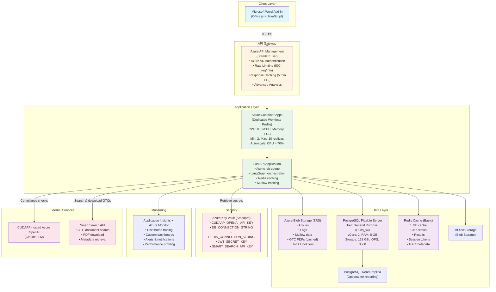
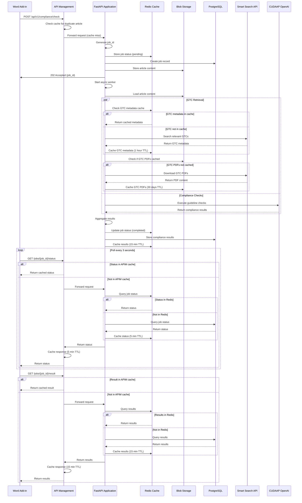
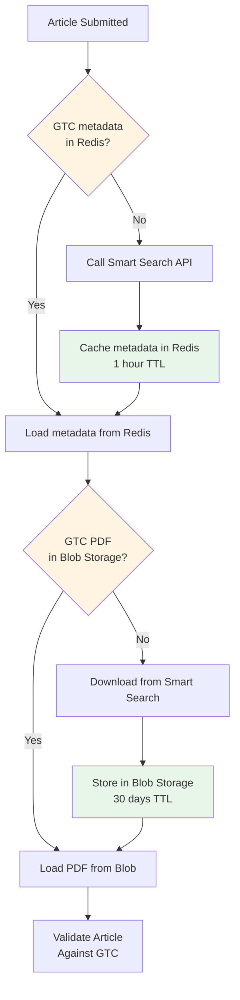

# Medium Scale Architecture (Production)

**Target Scale**: 1,000-10,000 users per day
**Monthly Cost Estimate**: €500-1500
**Region**: West Europe (primary)
**Use Case**: Production launch, growing user base, enhanced reliability

## Architecture Overview

This architecture introduces **auto-scaling**, **caching**, and **enhanced monitoring** to handle increased load while maintaining acceptable response times and reliability.



## Key Improvements Over Small Scale

### 1. **Always-On Instances**
- **Small Scale**: Min 0 replicas (scale to zero)
- **Medium Scale**: Min 2 replicas (always-on)
- **Benefit**: Eliminates cold start delays, instant response

### 2. **Redis Caching Layer**
- Cache frequently requested job results
- Cache job status to reduce DB queries
- Cache user session tokens
- TTL: 5-15 minutes depending on data type

### 3. **Enhanced Auto-Scaling**
- Scale based on CPU, memory, and request queue depth
- Faster scale-up response time
- Predictive scaling based on historical patterns

### 4. **Improved Database**
- General Purpose tier with more vCores and RAM
- Higher IOPS for faster queries
- Optional read replica for analytics/reporting
- Connection pooling optimizations

### 5. **Advanced Monitoring**
- Custom dashboards for key metrics
- Proactive alerts (before issues impact users)
- Performance profiling and bottleneck detection
- User-facing status page integration

### 6. **Storage Optimization**
- Zone-redundant storage (ZRS) for higher availability
- Lifecycle policies: Hot → Cool tier after 30 days
- Automated cleanup of old job data

## Azure Resources

### 1. Azure Container Apps (Dedicated)
- **Tier**: Dedicated Workload Profile
- **Configuration**:
  - Min instances: 2 (always-on)
  - Max instances: 10
  - CPU: 0.5 vCPU per instance
  - Memory: 1 GB per instance
  - Auto-scale rules:
    - CPU utilization > 70%
    - Request queue depth > 100
    - Custom metric: Job processing time > 60s
- **Cost**: ~€0.16/vCPU-hour, ~€0.02/GB-hour
- **Estimated Monthly Cost**: €150-300

### 2. Azure API Management
- **Tier**: Standard (or Developer for non-prod)
- **Features**:
  - 1 unit = 1,000 req/sec capacity
  - Built-in caching (up to 1 GB)
  - Advanced policies and transformations
  - Custom domains and SSL
  - Rate limiting: 500 requests/minute per user
- **Cost**: ~€0.25/hour (~€180/month for 1 unit)
- **Estimated Monthly Cost**: €180-200

### 3. Azure Database for PostgreSQL - Flexible Server
- **Tier**: General Purpose (D2ds_v4)
- **Configuration**:
  - vCore: 2
  - RAM: 8 GB
  - Storage: 128 GB
  - IOPS: 3500
  - Backup retention: 14 days
  - Geo-redundant backup: Yes
  - High Availability: Zone-redundant (optional, +€50/month)
  - Read Replica: Optional (for reporting, +€80/month)
- **Cost**: ~€120/month (base)
- **Estimated Monthly Cost**: €120-250 (with HA and replica)

### 4. Azure Cache for Redis
- **Tier**: Basic (C1)
- **Configuration**:
  - Cache size: 1 GB
  - SSL enabled
  - Persistence: Optional (RDB snapshots)
- **Use Cases**:
  - Job status caching (reduce DB load)
  - Recent results caching (5 min TTL)
  - Session token caching
  - Rate limiting counters
- **Cost**: ~€40/month
- **Estimated Monthly Cost**: €40-50

### 5. Azure Blob Storage
- **Tier**: Standard (Hot + Cool)
- **Redundancy**: ZRS (Zone-Redundant Storage)
- **Lifecycle Policy**:
  - Articles: Hot tier → Cool tier after 30 days → Delete after 180 days
  - Logs: Hot tier → Cool tier after 7 days → Delete after 90 days
  - MLflow artifacts: Hot tier → Cool tier after 60 days
- **Cost**: Hot: €0.018/GB/month, Cool: €0.01/GB/month
- **Estimated Monthly Cost**: €15-30

### 6. Azure Key Vault
- **Tier**: Standard
- **Operations**: ~50,000/month
- **Cost**: €0.03 per 10,000 operations
- **Estimated Monthly Cost**: €3-5

### 7. Application Insights
- **Tier**: Pay-as-you-go
- **Data Ingestion**: 20-50 GB/month
- **Features**:
  - Distributed tracing
  - Custom dashboards
  - Smart detection (anomalies)
  - Profiler and snapshot debugger
- **Cost**: €2.30/GB after 5 GB free
- **Estimated Monthly Cost**: €50-100

### 8. Azure Container Registry
- **Tier**: Standard
- **Storage**: 100 GB included
- **Geo-replication**: No (single region)
- **Cost**: ~€17/month
- **Estimated Monthly Cost**: €20

### 9. Azure Monitor
- **Usage**: Alerts, action groups, log queries
- **Cost**: Pay per alert rule, log data ingestion
- **Estimated Monthly Cost**: €10-20

## Total Cost Breakdown (Monthly)

| Service | Estimated Cost (EUR) |
|---------|---------------------|
| Azure Container Apps (Dedicated) | €150-300 |
| Azure API Management (Standard) | €180-200 |
| Azure Database for PostgreSQL | €120-250 |
| Azure Cache for Redis | €40-50 |
| Azure Blob Storage (ZRS) | €15-30 |
| Azure Key Vault | €3-5 |
| Application Insights | €50-100 |
| Azure Container Registry | €20 |
| Azure Monitor | €10-20 |
| **Total** | **€588-975/month** |

**Contingency Buffer (20%)**: €120-200
**Final Estimate**: **€500-1500/month**

## Performance Targets

### Latency
- **Job Submission**: < 500ms (99th percentile)
- **Job Status Check**: < 200ms (cached), < 500ms (uncached)
- **Job Result Retrieval**: < 1s (99th percentile)
- **Total Processing Time**: 15-40 seconds (depends on number of guidelines)

### Throughput
- **Concurrent Jobs**: Up to 10 simultaneous compliance checks
- **Daily Capacity**: 5,000-10,000 articles/day
- **Peak Load**: 50-100 requests/minute

### Availability
- **Uptime Target**: 99.5% (monthly)
- **Allowed Downtime**: ~3.6 hours/month
- **Recovery Time Objective (RTO)**: < 15 minutes
- **Recovery Point Objective (RPO)**: < 5 minutes

## Data Flow with Caching and Smart Search



## Redis Caching Strategy

### Cache Keys
```
job:status:{job_id}          → Job status (TTL: 5 min)
job:result:{job_id}          → Compliance results (TTL: 15 min)
user:ratelimit:{user_id}     → Rate limit counter (TTL: 1 min)
article:hash:{content_hash}  → Duplicate detection (TTL: 1 hour)
gtc:metadata:{search_hash}   → GTC search results metadata (TTL: 1 hour)
gtc:location:{gtc_id}        → GTC PDF blob location (TTL: 24 hours)
```

### Cache Invalidation
- **On Job Completion**: Update `job:status:{job_id}` and `job:result:{job_id}`
- **On Job Failure**: Remove cached entries
- **Manual**: Admin API to clear cache for specific job
- **GTC Updates**: Invalidate GTC cache when Smart Search API reports updates

## Auto-Scaling Configuration

### Scale-Out Rules (Add Instances)
```yaml
scale_rules:
  - name: cpu-scale-out
    type: cpu
    metadata:
      type: Utilization
      value: "70"

  - name: memory-scale-out
    type: memory
    metadata:
      type: Utilization
      value: "75"

  - name: queue-depth-scale-out
    type: http
    metadata:
      concurrentRequests: "100"
```

### Scale-In Rules (Remove Instances)
```yaml
scale_rules:
  - name: cpu-scale-in
    type: cpu
    metadata:
      type: Utilization
      value: "30"
    cooldown_period: 300  # 5 minutes before scaling in
```

## Monitoring and Alerts

### Key Metrics to Track

#### Application Metrics
- **Request Rate**: Requests/second
- **Error Rate**: % failed requests
- **Response Time**: P50, P95, P99 latency
- **Job Processing Time**: Average time per guideline check
- **Queue Depth**: Number of pending jobs

#### Infrastructure Metrics
- **CPU Utilization**: Per instance and aggregate
- **Memory Usage**: Per instance and aggregate
- **Database Connections**: Active connections count
- **Redis Hit Rate**: % cache hits vs misses
- **Blob Storage Throughput**: Read/write operations

### Alert Configuration

| Alert | Condition | Severity | Action |
|-------|-----------|----------|--------|
| High Error Rate | Error rate > 5% for 5 min | Critical | Page on-call engineer |
| Slow Response | P99 latency > 5s for 10 min | High | Send Slack notification |
| Database CPU High | CPU > 85% for 15 min | High | Alert DBA team |
| Redis Unavailable | Redis down for 1 min | Critical | Page on-call engineer |
| Low Cache Hit Rate | Cache hit rate < 50% | Medium | Investigate caching strategy |
| Scaling Limit | Max replicas reached | High | Consider architecture upgrade |

### Custom Dashboards

**Operations Dashboard**:
- Real-time request rate and error rate
- Active job count and queue depth
- Instance count and auto-scaling events
- Resource utilization (CPU, memory)

**Business Metrics Dashboard**:
- Daily active users
- Articles checked per day
- Average compliance score
- Most frequently triggered guidelines

## Enhanced Security

### Network Security
- **Private Endpoints**: Container Apps → PostgreSQL, Redis (optional, +€50/month)
- **VNet Integration**: Isolate backend services
- **API Management IP Restrictions**: Whitelist known IPs (if applicable)

### Authentication & Authorization
- **Azure AD B2C**: For external users (if needed)
- **API Keys**: For service-to-service calls
- **JWT Token Validation**: Strict token expiration (15 min)

### Secrets Rotation
- **Automated**: Key Vault secrets auto-rotation (90 days)
- **Manual**: Database passwords, API keys (on schedule)

## Smart Search API Integration

### Purpose
The Smart Search API provides advanced search and retrieval capabilities for General Terms & Conditions (GTC) documents. In the Medium Scale architecture, Smart Search integration is enhanced with multi-layer caching to optimize performance and reduce API costs.

### Integration Architecture

**Medium Scale Enhancements:**
- **Redis Caching**: GTC metadata cached in Redis (1 hour TTL)
- **Blob Caching**: GTC PDFs cached in Blob Storage (30 days TTL, ZRS redundancy)
- **Connection Pooling**: Dedicated HTTP connection pool for Smart Search API calls
- **Circuit Breaker**: Prevent cascading failures if Smart Search is unavailable
- **Retry Logic**: Exponential backoff with jitter (3 retries)

### Multi-Layer Caching Strategy



### Redis Cache Strategy for GTCs

**Cache Keys:**
```python
# GTC metadata cache (search results)
gtc:metadata:{search_hash}
  - TTL: 1 hour
  - Value: JSON with GTC IDs, titles, relevance scores

# GTC location cache (blob URLs)
gtc:location:{gtc_id}
  - TTL: 24 hours
  - Value: Blob Storage URL and metadata

# GTC search history (analytics)
gtc:search_history:{user_id}
  - TTL: 7 days
  - Value: List of recent search queries
```

**Cache Hit Rate Target**: >80% for GTC metadata, >70% for GTC PDFs

### Smart Search Client Implementation

```python
# Pseudo-code for Smart Search client with Redis caching
class SmartSearchClient:
    def __init__(self, api_key: str, redis_client: Redis, blob_client: BlobClient):
        self.api_key = api_key
        self.redis = redis_client
        self.blob = blob_client
        self.circuit_breaker = CircuitBreaker(
            failure_threshold=5,
            recovery_timeout=60
        )

    async def search_gtcs(self, query: str) -> List[GtcMetadata]:
        """Search GTCs with Redis caching"""
        # Generate cache key from query
        search_hash = hashlib.sha256(query.encode()).hexdigest()
        cache_key = f"gtc:metadata:{search_hash}"

        # Check Redis cache
        cached_result = await self.redis.get(cache_key)
        if cached_result:
            logger.info("GTC metadata cache hit", extra={"search_hash": search_hash})
            return json.loads(cached_result)

        # Cache miss - call Smart Search API with circuit breaker
        try:
            with self.circuit_breaker:
                results = await self._call_smart_search_api(query)

            # Cache results in Redis (1 hour TTL)
            await self.redis.setex(
                cache_key,
                3600,  # 1 hour
                json.dumps([r.dict() for r in results])
            )

            return results

        except CircuitBreakerError:
            logger.error("Smart Search API circuit breaker open")
            return []  # Return empty results, continue without GTC validation

    async def download_gtc_pdf(self, gtc_id: str) -> bytes:
        """Download GTC PDF with Blob Storage caching"""
        # Check if PDF is in Blob Storage
        blob_path = f"gtc-cache/{gtc_id}.pdf"
        cached_pdf = await self.blob.get_blob(blob_path)

        if cached_pdf and not self._is_expired(cached_pdf.metadata):
            logger.info("GTC PDF cache hit", extra={"gtc_id": gtc_id})
            return cached_pdf.content

        # Cache miss - download from Smart Search
        pdf_content = await self._download_from_smart_search(gtc_id)

        # Store in Blob Storage with 30-day TTL
        await self.blob.upload_blob(
            blob_path,
            pdf_content,
            metadata={
                "cached_at": datetime.utcnow().isoformat(),
                "expires_at": (datetime.utcnow() + timedelta(days=30)).isoformat(),
                "gtc_id": gtc_id
            }
        )

        # Update Redis location cache
        await self.redis.setex(
            f"gtc:location:{gtc_id}",
            86400,  # 24 hours
            blob_path
        )

        return pdf_content

    async def _call_smart_search_api(self, query: str) -> List[GtcMetadata]:
        """Call Smart Search API with retry logic"""
        async with httpx.AsyncClient() as client:
            for attempt in range(3):
                try:
                    response = await client.post(
                        f"{SMART_SEARCH_BASE_URL}/search",
                        json={"query": query, "limit": 5},
                        headers={"Authorization": f"Bearer {self.api_key}"},
                        timeout=10.0
                    )
                    response.raise_for_status()
                    return [GtcMetadata(**item) for item in response.json()["results"]]

                except httpx.HTTPError as e:
                    if attempt == 2:  # Last attempt
                        raise
                    # Exponential backoff with jitter
                    await asyncio.sleep(2 ** attempt + random.uniform(0, 1))
```

### Error Handling and Resilience

**Circuit Breaker Pattern:**
- Open circuit after 5 consecutive failures
- Half-open after 60 seconds
- Close circuit after 2 successful requests

**Fallback Strategies:**
1. **Smart Search Unavailable**: Continue compliance check without GTC validation
2. **Partial Results**: Accept cached GTCs even if some downloads fail
3. **Stale Cache**: Use expired GTC cache if Smart Search is down (with warning)

### Cost Optimization

**Estimated Smart Search API Costs (Medium Scale):**
- **Searches**: 1,000-5,000 per day at €0.01-0.05 per search = €10-250/day
- **Downloads**: 200-1,000 per day at €0.10-0.50 per download = €20-500/day
- **Monthly Estimate**: €900-22,500 (without caching)

**With Multi-Layer Caching:**
- **Searches**: 80% cache hit → 200-1,000 API calls/day = €2-50/day
- **Downloads**: 70% cache hit → 60-300 API calls/day = €6-150/day
- **Monthly Estimate**: €240-6,000 (67-74% cost reduction)

**Target Metrics:**
- Redis cache hit rate: >80%
- Blob cache hit rate: >70%
- Average API calls per article: <0.5
- Smart Search API costs: <€300/month

### Monitoring and Alerts

**Key Metrics:**
- `smart_search_api_calls_total` (counter)
- `smart_search_cache_hit_rate` (gauge)
- `smart_search_latency_seconds` (histogram)
- `smart_search_errors_total` (counter)
- `gtc_cache_size_bytes` (gauge)

**Alerts:**
- Smart Search API error rate > 5%
- Cache hit rate < 60%
- Circuit breaker open for > 5 minutes
- GTC cache size > 10 GB

For detailed Smart Search integration, see [Smart Search Integration Guide](../api/SMART_SEARCH_INTEGRATION.md).

## Database Optimization

### Connection Pooling
```python
# FastAPI database connection pool
from sqlalchemy import create_engine
from sqlalchemy.pool import QueuePool

engine = create_engine(
    DB_CONNECTION_STRING,
    poolclass=QueuePool,
    pool_size=20,         # Max connections per instance
    max_overflow=10,      # Extra connections if needed
    pool_pre_ping=True,   # Verify connection before use
    pool_recycle=3600     # Recycle connections every hour
)
```

### Index Optimization
```sql
-- Add indexes for frequent queries
CREATE INDEX idx_jobs_status_created ON jobs(status, created_at DESC);
CREATE INDEX idx_jobs_user_status ON jobs(user_id, status);
CREATE INDEX idx_results_job_guideline ON compliance_results(job_id, guideline_id);

-- Covering index for job status checks
CREATE INDEX idx_jobs_status_lookup ON jobs(job_id, status, updated_at);
```

### Query Optimization
- Use `EXPLAIN ANALYZE` to identify slow queries
- Implement pagination for large result sets
- Use read replica for analytics queries

## Deployment Strategy

### Blue-Green Deployment
```bash
# Deploy new version to "green" environment
az containerapp update \
  --name compliance-api-green \
  --image {acr}.azurecr.io/compliance-api:v2.0

# Run smoke tests on green environment
./scripts/smoke-test.sh https://green.compliance-api.com

# Switch traffic to green (API Management routing)
az apim api update \
  --backend-url https://green.compliance-api.com

# Monitor for 10 minutes
# If issues: rollback to blue
# If success: decommission blue
```

### Zero-Downtime Migration
- Use API versioning (`/api/v1`, `/api/v2`)
- Maintain backward compatibility for 1 release cycle
- Gradual traffic shift (10% → 50% → 100%)

## When to Scale to Large Architecture

Migrate to Large Scale when you observe:
- **User Growth**: Approaching 8,000-10,000 users/day
- **Geographic Expansion**: Users from multiple regions experiencing latency
- **Scaling Limits**: Frequently hitting max 10 replicas
- **Database Bottleneck**: Read queries slowing down despite optimization
- **Compliance Requirements**: Need for multi-region data residency
- **Availability Requirements**: Need for 99.9%+ uptime SLA

See [Migration Guide](./MIGRATION_GUIDE.md) for step-by-step upgrade path to Large Scale.

---

**Document Version**: 1.0
**Last Updated**: 2025-10-02
**Target Audience**: Production deployment, 1K-10K users/day
