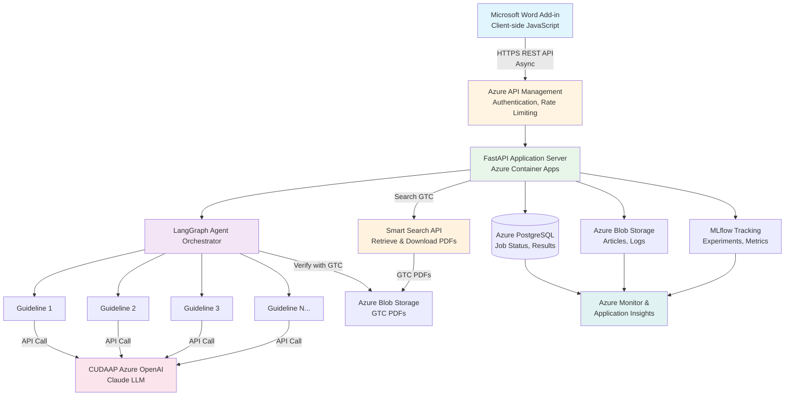
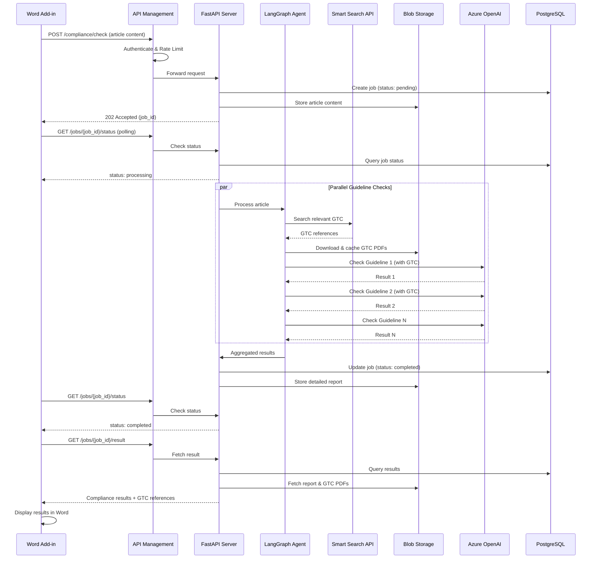

# Marketing Content Compliance Assistant - Architecture Overview

## Executive Summary

The Marketing Content Compliance Assistant is an AI-powered system that analyzes marketing articles against a set of compliance guidelines in parallel. The system is designed as a Microsoft Word Add-in integration, allowing users to check compliance directly within their document editing workflow.

## System Purpose

- **Primary Function**: Analyze marketing content for compliance with configurable set of guidelines
- **User Interface**: Microsoft Word Add-in
- **Analysis Engine**: LangGraph-based agentic system with parallel execution
- **AI Provider**: CUDAAP-hosted Azure OpenAI
- **Target Users**: Marketing teams, content creators, compliance officers
- **Geography**: Europe (EU region)

## High-Level Architecture



## Core Components

### 1. **Microsoft Word Add-in (Client)**
- **Technology**: Office.js, JavaScript/TypeScript
- **Responsibility**:
  - Capture article content from Word document
  - Submit compliance check requests
  - Poll for job status
  - Display compliance results and suggested changes
- **Authentication**: Microsoft 365 / Azure AD integration

### 2. **Azure API Management**
- **Responsibility**:
  - API gateway for all backend requests
  - Authentication and authorization (OAuth 2.0 / Azure AD)
  - Rate limiting and throttling
  - Request/response transformation
  - API versioning
  - CORS configuration for Word Add-in

### 3. **FastAPI Application Server**
- **Technology**: Python, FastAPI, Uvicorn
- **Hosting**: Azure Container Apps (MVP) or Azure App Service
- **Responsibility**:
  - Expose RESTful API endpoints
  - Handle async job submission and status polling
  - Orchestrate LangGraph agent execution
  - Manage job queue and state
  - Return compliance results

### 4. **LangGraph Agent System**
- **Technology**: LangGraph, LangChain
- **Execution Pattern**: Parallel guideline checking
- **AI Model**: CUDAAP-hosted Azure OpenAI (Claude)
- **Responsibility**:
  - Parse and analyze article content
  - Execute N compliance checks in parallel (configurable set of guidelines)
  - Aggregate results and generate suggestions
  - Track execution with MLflow

### 5. **Data Storage Layer**

#### **Azure Cosmos DB / PostgreSQL**
- Store job metadata (job_id, status, timestamps)
- Store compliance check results
- Store user session data
- Query job history

#### **Azure Blob Storage**
- Store article content (raw text)
- Store detailed compliance reports
- Archive logs and audit trails

#### **Azure Redis Cache (Optional for MVP)**
- Cache API responses
- Store session tokens
- Rate limiting counters

### 6. **MLflow Tracking**
- **Hosting**: Azure Machine Learning or self-hosted on Azure Container Apps
- **Responsibility**:
  - Log experiment parameters (article_id, guidelines checked)
  - Track metrics (compliance scores, execution time)
  - Version control for agent configurations
  - Model performance monitoring

### 7. **Monitoring & Observability**
- **Azure Application Insights**: Application-level telemetry, traces, exceptions
- **Azure Monitor**: Infrastructure-level metrics, alerts
- **Azure Log Analytics**: Centralized log aggregation

### 8. **Smart Search API Integration**
- **Purpose**: Search and retrieve relevant General Terms & Conditions (GTC) documents
- **Integration Point**: Called by LangGraph agent during compliance checks
- **Workflow**:
  1. Agent identifies need for GTC verification
  2. Makes API call to Smart Search with search query
  3. Smart Search returns relevant GTC document references
  4. System downloads PDF from Smart Search
  5. Stores PDF in Azure Blob Storage for agent/user verification
  6. Agent uses GTC content to verify article compliance
- **API Authentication**: API key or OAuth token (stored in Azure Key Vault)
- **Caching**: Downloaded GTCs cached in Blob Storage to avoid repeated downloads

### 9. **Security & Identity**
- **Azure Key Vault**: Store secrets (CUDAAP OpenAI API key, DB credentials, Smart Search API key)
- **Azure Managed Identity**: Service-to-service authentication
- **Azure Active Directory**: User authentication for Word Add-in

## Data Flow

### Compliance Check Flow (Async)



## Design Principles

### 1. **Asynchronous Processing**
- Long-running compliance checks handled via async pattern
- Immediate job_id return (202 Accepted)
- Status polling or webhook callbacks
- Prevents timeout issues in Word Add-in

### 2. **Parallel Execution**
- Configurable set of guidelines run concurrently
- Reduces total processing time
- LangGraph manages parallel execution
- Scalable to any number of compliance checks

### 3. **Cost Optimization**
- Serverless/container-based compute (pay-per-use)
- Minimal idle resources
- EU region only (West Europe or North Europe)
- Basic tier for MVP, scale as needed

### 4. **Security First**
- All secrets in Azure Key Vault
- Managed identities for service-to-service auth
- Azure AD for user authentication
- HTTPS everywhere
- CORS properly configured

### 5. **Observability**
- Application Insights for request tracing
- MLflow for agent performance tracking
- Structured logging
- Alerts for failures and latency

### 6. **Scalability**
- Stateless FastAPI application (easy horizontal scaling)
- Job queue for load management
- Database for persistent state
- Autoscaling based on request volume

## Technology Stack Summary

| Component | Technology | Azure Service |
|-----------|-----------|---------------|
| API Gateway | - | Azure API Management (Consumption tier) |
| Application Server | FastAPI, Python | Azure Container Apps / App Service |
| Agent Framework | LangGraph, LangChain | - |
| AI Model | Claude (via Azure OpenAI) | CUDAAP-hosted Azure OpenAI |
| Job Queue | Python asyncio | Azure Storage Queue (optional) |
| Database | PostgreSQL / NoSQL | Azure Database for PostgreSQL / Cosmos DB |
| Object Storage | - | Azure Blob Storage |
| Caching | Redis | Azure Cache for Redis (optional) |
| Experiment Tracking | MLflow | Azure ML or self-hosted |
| Secrets Management | - | Azure Key Vault |
| Authentication | OAuth 2.0 | Azure Active Directory / Entra ID |
| Monitoring | - | Application Insights, Azure Monitor |
| Container Registry | - | Azure Container Registry |
| IaC | Terraform | - |

## Deployment Model

- **Containerization**: Docker multi-stage builds
- **CI/CD**: GitHub Actions or Azure DevOps Pipelines
- **Infrastructure as Code**: Terraform
- **Environment Strategy**: Dev, Staging, Production
- **Region**: West Europe (primary), North Europe (failover for large scale)

## API Design Philosophy

### RESTful Async Pattern
```
POST   /api/v1/compliance/check       → Submit article, return job_id
GET    /api/v1/jobs/{job_id}/status   → Poll job status
GET    /api/v1/jobs/{job_id}/result   → Fetch compliance results
DELETE /api/v1/jobs/{job_id}          → Cancel job (optional)
```

### Response Format
```json
{
  "job_id": "uuid-string",
  "status": "pending|processing|completed|failed",
  "created_at": "ISO8601 timestamp",
  "updated_at": "ISO8601 timestamp",
  "result": {
    "compliance_score": 0.85,
    "guidelines": [
      {
        "guideline_id": 1,
        "status": "pass|fail|warning",
        "suggestions": ["suggestion 1", "suggestion 2"],
        "explanation": "Why this suggestion is made"
      }
    ]
  }
}
```

## Progressive Scaling Architecture

### **Small Scale (MVP)**: 0-1000 users/day
- Single region (West Europe)
- Azure Container Apps (consumption plan)
- Azure Database for PostgreSQL (Basic tier)
- Blob Storage (LRS)
- Application Insights (Basic)
- **Estimated Cost**: €100-300/month

### **Medium Scale**: 1000-10,000 users/day
- Single region with auto-scaling
- Azure Container Apps (dedicated plan)
- PostgreSQL (General Purpose tier)
- Redis Cache for response caching
- Enhanced monitoring and alerts
- **Estimated Cost**: €500-1500/month

### **Large Scale (Enterprise)**: 10,000+ users/day
- Multi-region (West Europe + North Europe)
- Azure Front Door for global load balancing
- PostgreSQL with read replicas
- Redis Premium with clustering
- Dedicated MLflow infrastructure
- Comprehensive disaster recovery
- **Estimated Cost**: €2000-5000/month

## Next Steps

1. Review detailed architecture for each scale:
   - [Small Scale Architecture (MVP)](./ARCHITECTURE_SMALL_SCALE.md)
   - [Medium Scale Architecture](./ARCHITECTURE_MEDIUM_SCALE.md)
   - [Large Scale Architecture (Enterprise)](./ARCHITECTURE_LARGE_SCALE.md)

2. Understand migration path:
   - [Migration Guide](./MIGRATION_GUIDE.md)

3. Implementation guides:
   - [API Specification](../api/API_SPECIFICATION.md)
   - [Microsoft Word Integration](../api/MICROSOFT_WORD_INTEGRATION.md)
   - [Deployment Guide](../operations/DEPLOYMENT_GUIDE.md)
   - [MLflow Azure Integration](../operations/MLFLOW_AZURE_INTEGRATION.md)
   - [Monitoring and Operations](../operations/MONITORING_AND_OPERATIONS.md)

## Architectural Decision Records (ADRs)

### ADR-001: Asynchronous API Pattern
**Decision**: Use async pattern (submit → poll) instead of synchronous (submit → wait)
**Rationale**:
- Compliance checks can take 10-30+ seconds
- Prevents timeout issues in Word Add-in
- Allows better scaling and resource management
- Standard pattern for long-running operations

### ADR-002: Azure Container Apps vs App Service
**Decision**: Prefer Azure Container Apps for MVP
**Rationale**:
- Consumption-based pricing (pay-per-use)
- Built-in autoscaling
- Kubernetes-like experience without complexity
- Easy to migrate to AKS later if needed

### ADR-003: PostgreSQL vs Cosmos DB
**Decision**: PostgreSQL for MVP, evaluate Cosmos DB for global scale
**Rationale**:
- PostgreSQL: Lower cost, familiar SQL, ACID guarantees
- Cosmos DB: Better for multi-region, but higher cost
- Start with PostgreSQL, migrate if global scale needed

### ADR-004: MLflow Hosting
**Decision**: Self-host MLflow on Azure Container Apps for MVP
**Rationale**:
- Azure ML is more expensive for MVP
- Self-hosted MLflow is sufficient for single-region
- Can migrate to Azure ML later for enterprise features

### ADR-005: CUDAAP Azure OpenAI
**Decision**: Use CUDAAP-provided Azure OpenAI API key
**Rationale**:
- Pre-provisioned by organization
- Simplified billing
- Store key in Azure Key Vault

---

**Document Version**: 1.0
**Last Updated**: 2025-10-02
**Maintained By**: Architecture Team
