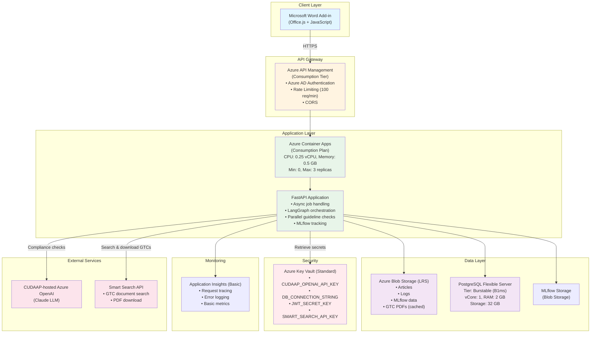
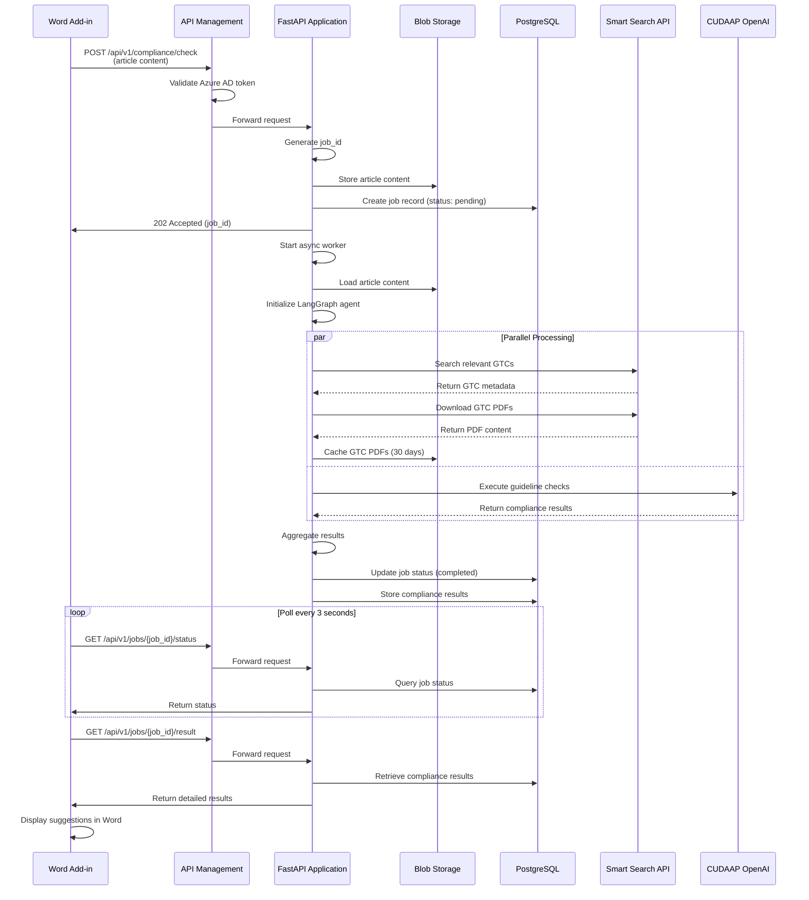
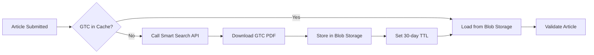

# Small Scale Architecture (MVP)

**Target Scale**: 0-1000 users per day
**Monthly Cost Estimate**: €100-300
**Region**: West Europe (primary)
**Use Case**: Proof of concept, initial launch, internal testing

## Architecture Overview

This architecture is optimized for **minimal cost** while providing a functional compliance checking system. It uses consumption-based pricing wherever possible and avoids redundancy.



## Azure Resources

### 1. Azure Container Apps
- **Tier**: Consumption Plan
- **Configuration**:
  - Min instances: 0 (scale to zero when idle)
  - Max instances: 3
  - CPU: 0.25 vCPU per instance
  - Memory: 0.5 GB per instance
  - Cold start: ~5-10 seconds (acceptable for MVP)
- **Cost**: Pay per second of execution (~€0.000015/vCPU-second, ~€0.000002/GB-second)
- **Estimated Monthly Cost**: €20-50 (based on usage patterns)

### 2. Azure API Management
- **Tier**: Consumption
- **Features**:
  - 1 million calls/month included
  - Auto-scaling
  - OAuth 2.0 / Azure AD authentication
  - Rate limiting: 100 requests/minute per user
  - CORS configuration
- **Cost**: €0.0028 per 10,000 calls after free tier
- **Estimated Monthly Cost**: €0-10

### 3. Azure Database for PostgreSQL - Flexible Server
- **Tier**: Burstable (B1ms)
- **Configuration**:
  - vCore: 1
  - RAM: 2 GB
  - Storage: 32 GB
  - Backup retention: 7 days
  - Geo-redundancy: No
- **Cost**: ~€25/month
- **Tables**:
  - `jobs`: job_id, status, user_id, created_at, updated_at
  - `compliance_results`: job_id, guideline_id, status, suggestions, explanation
  - `users`: user_id, email, created_at (optional for MVP)

### 4. Azure Blob Storage
- **Tier**: Standard (Hot tier)
- **Redundancy**: LRS (Locally Redundant Storage)
- **Containers**:
  - `articles`: Store article content
  - `compliance-reports`: Detailed compliance reports
  - `mlflow-artifacts`: MLflow experiment artifacts
  - `logs`: Application logs (if needed)
- **Cost**: ~€0.018 per GB/month + transaction costs
- **Estimated Monthly Cost**: €5-10

### 5. Azure Key Vault
- **Tier**: Standard
- **Secrets**:
  - `CUDAAP-OPENAI-API-KEY`
  - `DB-CONNECTION-STRING`
  - `JWT-SECRET-KEY`
  - `BLOB-STORAGE-CONNECTION-STRING`
  - `SMART-SEARCH-API-KEY` (for GTC document retrieval)
- **Cost**: ~€0.03 per 10,000 operations
- **Estimated Monthly Cost**: €1-3

### 6. Application Insights
- **Tier**: Pay-as-you-go (Basic)
- **Data Ingestion**: Up to 5 GB/month (often sufficient for MVP)
- **Features**:
  - Request/response logging
  - Exception tracking
  - Basic performance metrics
  - Custom events
- **Cost**: €2.30/GB after 5 GB free
- **Estimated Monthly Cost**: €10-20

### 7. Azure Container Registry
- **Tier**: Basic
- **Storage**: 10 GB included
- **Usage**: Store Docker images for FastAPI app
- **Cost**: ~€4.25/month
- **Estimated Monthly Cost**: €5

### 8. Azure Monitor (Basic)
- **Usage**: Infrastructure-level monitoring
- **Cost**: Included with other services for basic metrics
- **Estimated Monthly Cost**: €0-5

## Total Cost Breakdown (Monthly)

| Service | Estimated Cost (EUR) |
|---------|---------------------|
| Azure Container Apps | €20-50 |
| Azure API Management | €0-10 |
| Azure Database for PostgreSQL | €25 |
| Azure Blob Storage | €5-10 |
| Azure Key Vault | €1-3 |
| Application Insights | €10-20 |
| Azure Container Registry | €5 |
| Azure Monitor | €0-5 |
| **Total** | **€66-128/month** |

**Contingency Buffer (30%)**: €20-40
**Final Estimate**: **€100-300/month**

## Data Flow

### Article Submission Flow with Smart Search Integration



### Parallel Guideline Checking with GTC Retrieval (LangGraph)

```python
# Pseudo-code for LangGraph agent with Smart Search integration
async def check_compliance(article_content: str, guidelines: List[Guideline]):
    with mlflow.start_run():
        mlflow.log_param("article_length", len(article_content))
        mlflow.log_param("num_guidelines", len(guidelines))

        # Step 1: Search and retrieve relevant GTCs
        gtc_search_task = search_relevant_gtcs(article_content)

        # Step 2: Parallel execution of N guidelines (configurable)
        guideline_tasks = [
            check_guideline(article_content, guideline)
            for guideline in guidelines
        ]

        # Execute GTC search and guideline checks in parallel
        gtc_documents, *guideline_results = await asyncio.gather(
            gtc_search_task,
            *guideline_tasks
        )

        # Step 3: Validate article against retrieved GTCs
        if gtc_documents:
            gtc_validation = await validate_against_gtcs(
                article_content,
                gtc_documents
            )
            guideline_results.append(gtc_validation)
            mlflow.log_param("gtc_documents_found", len(gtc_documents))

        # Aggregate results
        compliance_report = aggregate_results(guideline_results)
        mlflow.log_metric("compliance_score", compliance_report.score)

        return compliance_report

async def search_relevant_gtcs(article_content: str) -> List[GtcDocument]:
    """Search and download relevant GTC documents using Smart Search API"""
    # Extract keywords/entities from article for search
    search_query = extract_search_terms(article_content)

    # Call Smart Search API
    search_results = await smart_search_client.search(query=search_query)

    # Download and cache GTC PDFs
    gtc_documents = []
    for result in search_results:
        # Check if already cached in Blob Storage
        cached_pdf = await blob_storage.get_cached_gtc(result.gtc_id)

        if not cached_pdf:
            # Download from Smart Search
            pdf_content = await smart_search_client.download_pdf(result.gtc_id)
            # Cache in Blob Storage (30 days TTL)
            await blob_storage.cache_gtc(result.gtc_id, pdf_content, ttl_days=30)
            cached_pdf = pdf_content

        gtc_documents.append(GtcDocument(
            id=result.gtc_id,
            content=cached_pdf,
            relevance_score=result.score
        ))

    return gtc_documents
```

## Smart Search API Integration

### Purpose
The Smart Search API is an external service that provides search and retrieval capabilities for General Terms & Conditions (GTC) documents. During compliance checking, the system uses Smart Search to:
1. Find relevant GTC documents based on article content
2. Download GTC PDFs for validation
3. Cache downloaded PDFs to reduce API calls and costs

### Integration Points

**In Small Scale Architecture:**
- **Location**: FastAPI application makes direct API calls to Smart Search
- **Authentication**: API key stored in Azure Key Vault
- **Caching**: GTC PDFs cached in Azure Blob Storage (30-day TTL)
- **Error Handling**: Graceful degradation if Smart Search is unavailable
- **Rate Limiting**: Respect Smart Search API rate limits (if applicable)

### GTC Caching Strategy



**Blob Storage Structure:**
```
gtc-cache/
├── {gtc_id_1}.pdf (cached 2025-09-15, expires 2025-10-15)
├── {gtc_id_2}.pdf (cached 2025-09-20, expires 2025-10-20)
└── metadata.json (tracking cache entries)
```

**Cache Lifecycle:**
- **TTL**: 30 days from download
- **Eviction**: Automatic deletion after expiration
- **Refresh**: Re-download if requested after expiration
- **Storage Cost**: ~€0.018/GB/month (Hot tier)

### Error Handling

**Scenario 1: Smart Search API Unavailable**
- Retry with exponential backoff (3 attempts)
- If all retries fail: Continue compliance check without GTC validation
- Log error to Application Insights
- Return partial results with warning

**Scenario 2: GTC Not Found**
- Log search query for analysis
- Continue compliance check with available guidelines
- Include "GTC not found" in compliance report

**Scenario 3: PDF Download Failure**
- Retry download (2 attempts)
- Fall back to cached version if available (even if expired)
- Log failure for manual investigation

### Cost Considerations

**Smart Search API Costs:**
- Depends on Smart Search pricing model (per search, per download, subscription)
- **Estimated**: €0.01-0.05 per search + €0.10-0.50 per PDF download
- **Monthly Estimate (Small Scale)**: €20-50 (assuming 200-500 articles/day, 20% requiring GTC lookup)

**Optimization Strategies:**
1. Aggressive caching (30-day TTL reduces repeat downloads)
2. Batch GTC searches when possible
3. Implement rate limiting to avoid excessive API calls
4. Monitor cache hit rate (target: >60%)

For detailed Smart Search integration, see [Smart Search Integration Guide](../api/SMART_SEARCH_INTEGRATION.md).

## Deployment Configuration

### Container Apps Configuration

```yaml
# container-app-config.yaml
properties:
  managedEnvironmentId: /subscriptions/{sub}/resourceGroups/{rg}/providers/Microsoft.App/managedEnvironments/{env}
  configuration:
    ingress:
      external: false  # Only accessible via API Management
      targetPort: 8000
      transport: http
    secrets:
      - name: openai-api-key
        keyVaultUrl: https://{vault}.vault.azure.net/secrets/CUDAAP-OPENAI-API-KEY
      - name: db-connection-string
        keyVaultUrl: https://{vault}.vault.azure.net/secrets/DB-CONNECTION-STRING
    registries:
      - server: {acr}.azurecr.io
        identity: system
  template:
    containers:
      - name: fastapi-app
        image: {acr}.azurecr.io/compliance-api:latest
        resources:
          cpu: 0.25
          memory: 0.5Gi
        env:
          - name: CUDAAP_OPENAI_API_KEY
            secretRef: openai-api-key
          - name: DB_CONNECTION_STRING
            secretRef: db-connection-string
          - name: SMART_SEARCH_API_KEY
            secretRef: smart-search-api-key
          - name: ENVIRONMENT
            value: "production"
    scale:
      minReplicas: 0
      maxReplicas: 3
      rules:
        - name: http-rule
          http:
            metadata:
              concurrentRequests: "10"
```

### PostgreSQL Schema

```sql
-- jobs table
CREATE TABLE jobs (
    job_id UUID PRIMARY KEY,
    user_id VARCHAR(255) NOT NULL,
    status VARCHAR(50) NOT NULL CHECK (status IN ('pending', 'processing', 'completed', 'failed')),
    article_blob_url TEXT NOT NULL,
    created_at TIMESTAMP DEFAULT CURRENT_TIMESTAMP,
    updated_at TIMESTAMP DEFAULT CURRENT_TIMESTAMP,
    error_message TEXT
);

CREATE INDEX idx_jobs_user_id ON jobs(user_id);
CREATE INDEX idx_jobs_status ON jobs(status);
CREATE INDEX idx_jobs_created_at ON jobs(created_at);

-- compliance_results table
CREATE TABLE compliance_results (
    result_id SERIAL PRIMARY KEY,
    job_id UUID NOT NULL REFERENCES jobs(job_id) ON DELETE CASCADE,
    guideline_id INTEGER NOT NULL,
    guideline_name VARCHAR(255),
    status VARCHAR(50) CHECK (status IN ('pass', 'fail', 'warning')),
    suggestions JSONB,
    explanation TEXT,
    created_at TIMESTAMP DEFAULT CURRENT_TIMESTAMP
);

CREATE INDEX idx_results_job_id ON compliance_results(job_id);
```

## API Endpoints (MVP)

### 1. Submit Compliance Check
```http
POST /api/v1/compliance/check
Authorization: Bearer <azure_ad_token>
Content-Type: application/json

{
  "article_content": "Marketing article text here...",
  "user_id": "user@company.com"
}

Response (202 Accepted):
{
  "job_id": "550e8400-e29b-41d4-a716-446655440000",
  "status": "pending",
  "created_at": "2025-10-02T10:30:00Z"
}
```

### 2. Check Job Status
```http
GET /api/v1/jobs/{job_id}/status
Authorization: Bearer <azure_ad_token>

Response (200 OK):
{
  "job_id": "550e8400-e29b-41d4-a716-446655440000",
  "status": "processing",
  "created_at": "2025-10-02T10:30:00Z",
  "updated_at": "2025-10-02T10:30:15Z"
}
```

### 3. Get Compliance Results
```http
GET /api/v1/jobs/{job_id}/result
Authorization: Bearer <azure_ad_token>

Response (200 OK):
{
  "job_id": "550e8400-e29b-41d4-a716-446655440000",
  "status": "completed",
  "compliance_score": 0.85,
  "guidelines": [
    {
      "guideline_id": 1,
      "guideline_name": "Brand Voice Consistency",
      "status": "pass",
      "suggestions": [],
      "explanation": "Article maintains consistent brand voice."
    },
    {
      "guideline_id": 2,
      "guideline_name": "Legal Compliance",
      "status": "warning",
      "suggestions": [
        "Add disclaimer about product limitations",
        "Include required regulatory information"
      ],
      "explanation": "Article is missing required legal disclaimers."
    }
  ],
  "created_at": "2025-10-02T10:30:00Z",
  "completed_at": "2025-10-02T10:30:45Z"
}
```

## Security Configuration

### Azure AD Authentication Flow
```
1. User signs into Word Add-in with Microsoft 365 account
   ↓
2. Add-in requests Azure AD token (OAuth 2.0)
   Scope: api://{app_id}/Compliance.Check
   ↓
3. User grants consent (one-time)
   ↓
4. Add-in receives access token
   ↓
5. Add-in includes token in Authorization header for API calls
   ↓
6. API Management validates token with Azure AD
   ↓
7. If valid, request proceeds to Container Apps
```

### Key Vault Access
- **Managed Identity**: Container Apps uses system-assigned managed identity
- **Access Policy**: Grant "Get Secret" permission to managed identity
- **No hardcoded secrets** in code or environment variables

## Monitoring and Alerts

### Application Insights Queries

**Track Average Processing Time**:
```kusto
requests
| where name contains "compliance/check"
| summarize avg(duration) by bin(timestamp, 1h)
```

**Track Failed Jobs**:
```kusto
customEvents
| where name == "JobFailed"
| summarize count() by bin(timestamp, 1h)
```

### Basic Alerts

1. **High Error Rate**: Alert if error rate > 5% in 5 minutes
2. **Slow Response Time**: Alert if average response time > 60 seconds
3. **Database Connection Issues**: Alert on repeated DB connection failures

## Limitations and Constraints

### Performance
- **Cold Start**: 5-10 seconds when scaling from zero
- **Concurrent Jobs**: Max 3 concurrent compliance checks (3 replicas × 1 job each)
- **Processing Time**: 20-45 seconds per article (depends on number of guidelines)
- **Article Size**: Max 50 KB per article (configurable)
- **Guidelines**: Configurable set (processing time scales with number of guidelines)

### Scalability
- **Max Users**: 1000 users/day (~500 articles/day)
- **Rate Limit**: 100 requests/minute per user
- **No caching**: Direct API calls every time (add Redis in Medium Scale)

### Availability
- **Single Region**: No failover to other regions
- **Uptime**: ~99% (Container Apps consumption tier SLA)
- **Backup**: 7-day database backup retention

### Data Retention
- **Job History**: 30 days (cleanup old records)
- **MLflow Experiments**: 90 days
- **Blob Storage**: 90 days for articles, 30 days for logs

## Deployment Steps (Quick Start)

### 1. Prerequisites
```bash
# Install Azure CLI
az login
az account set --subscription {subscription_id}

# Install Terraform
brew install terraform  # macOS
```

### 2. Deploy Infrastructure
```bash
cd infrastructure/small-scale
terraform init
terraform plan -out=tfplan
terraform apply tfplan
```

### 3. Build and Push Docker Image
```bash
# Build Docker image
docker build -t compliance-api:latest .

# Tag and push to ACR
az acr login --name {acr_name}
docker tag compliance-api:latest {acr_name}.azurecr.io/compliance-api:latest
docker push {acr_name}.azurecr.io/compliance-api:latest
```

### 4. Configure Secrets
```bash
# Store CUDAAP API key
az keyvault secret set --vault-name {vault_name} \
  --name CUDAAP-OPENAI-API-KEY \
  --value "{your_api_key}"

# Store DB connection string
az keyvault secret set --vault-name {vault_name} \
  --name DB-CONNECTION-STRING \
  --value "{connection_string}"
```

### 5. Deploy Container App
```bash
az containerapp update \
  --name compliance-api \
  --resource-group {rg_name} \
  --image {acr_name}.azurecr.io/compliance-api:latest
```

### 6. Initialize Database
```bash
# Run schema migration
psql -h {postgres_host} -U {admin_user} -d compliance_db -f schema.sql
```

## When to Scale to Medium Architecture

Migrate to Medium Scale when you observe:
- **User Growth**: Approaching 800-1000 users/day
- **Cold Starts**: Users complaining about slow initial response
- **Concurrent Limit**: Hitting max 3 replicas frequently
- **Database Load**: PostgreSQL CPU > 70% consistently
- **Repeated Queries**: Same articles checked multiple times (need caching)

See [Migration Guide](./MIGRATION_GUIDE.md) for step-by-step upgrade path.

---

**Document Version**: 1.0
**Last Updated**: 2025-10-02
**Target Audience**: MVP deployment, internal testing
